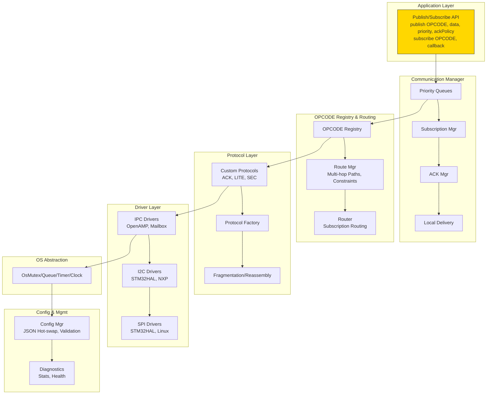
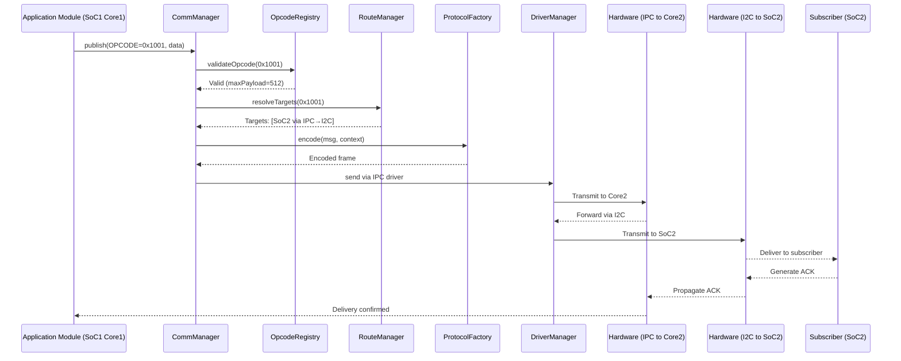

# OPCODE Messaging System

<div align="center">
  
  <br>
  <em>A robust, distributed messaging system for heterogeneous embedded platforms</em>
</div>

## Overview

The OPCODE Messaging System is a comprehensive communication framework designed for distributed embedded systems with multiple SoCs and heterogeneous cores (ARM, DSP, etc.). It provides a flexible, configurable messaging architecture based on the publish/subscribe pattern with OPCODE-centric routing.

This architecture enables modules to communicate via messages without knowledge of the underlying topology, making your system more modular and easier to maintain.

## Key Features

- **OPCODE-Centric Design**: Message routing based on OPCODEs rather than direct addressing
- **Multi-SoC Support**: Seamless communication across different processors and cores
- **Multiple Transport Layers**: Support for IPC, I2C, SPI, UART, and other interfaces
- **Configurable QoS**: Multiple priority levels with appropriate handling
- **Hot-Swappable Configuration**: Runtime reconfiguration with JSON-based definitions
- **Reliability Mechanisms**: Acknowledgments, retries, timeouts, and circuit breakers
- **Platform Independence**: Cross-platform compatibility (FreeRTOS, Linux, bare-metal)
- **Security Integration**: Authentication, encryption, and access control capabilities

## Documentation

Detailed documentation can be found in the `docs` directory:

- [Core Architecture](docs/1-opcode-messaging-system.md)
- [Configuration Examples](docs/2-opcode-messaging-system-config.md)
- [Usage Examples & Best Practices](docs/3-opcode-messaging-system-usage.md)
- [Supplementary Information](docs/4-opcode-messaging-system-supplementary.md)
- [Manager Best Practices](docs/5-opcode-messaging-system-managers.md)
- [Advanced Visualization](docs/6-opcode-messaging-system-visualization.md)
- [Extended UML Design](docs/7-opcode-messaging-system-extended-uml.md)

## Architecture

The system follows a layered architecture with clear separation of responsibilities:



## Class Diagram Overview
```mermaid
classDiagram
    direction TB

    %% Core interfaces
    class IRouter {
        <<interface>>
        +resolveOpcodeTargets(uint16_t opcode) vector~ForwardingTarget~
        +addRoute(RouteConfig route) Result
        +addPath(TopologyPath path) Result
        +findBestPath(string src, string dst) Path
        +handleTopologyChange(string nodeId, bool isAvailable)
    }

    class IProtocol {
        <<interface>>
        +encode(Message msg, vector~uint8_t~& output) Result
        +decode(span~uint8_t~ data, Message& msg, ProtocolMeta& meta) Result
        +encodeAck(uint32_t token, vector~uint8_t~& output) Result
        +getCapabilities() ProtocolCapabilities
    }

    class IDriver {
        <<interface>>
        +initialize() Result
        +send(span~uint8_t~ data) Result
        +receive(vector~uint8_t~& data, uint32_t timeoutMs) Result
        +getCapabilities() DriverCapabilities
        +shutdown() void
        +registerReceiveCallback(function~void(span~uint8_t~)~ callback)
    }

    class IDriverFactory {
        <<interface>>
        +createDriver(DriverConfig config) unique_ptr~IDriver~
        +supportsDriverType(string type, string variant) bool
    }

    class IProtocolFactory {
        <<interface>>
        +createProtocol(ProtocolConfig config) unique_ptr~IProtocol~
        +supportsProtocolType(string type) bool
    }

    %% Core message structures
    class Message {
        +uint16_t opcode
        +span~const uint8_t~ payload
    }

    class MessageContext {
        +Priority priority
        +AckPolicy ackPolicy
        +function~void(bool)~ ackCallback
        +uint32_t timeoutMs
        +bool isRetry
    }

    class ForwardingTarget {
        +string nextHop
        +string driverId
        +string protocolId
        +string finalDestination
        +vector~string~ remainingHops
        +bool isLocal
        +size_t subscriptionIndex
    }

    class ProtocolMeta {
        +bool isForwarded
        +string finalDestination
        +uint32_t token
        +uint8_t hopCount
        +bool requiresAck
        +Priority priority
    }

    %% Main managers
    class CommManager {
        -OpcodeRegistry m_opcodeRegistry
        -shared_ptr~IRouter~ m_router
        -shared_ptr~DriverManager~ m_driverManager
        -shared_ptr~ProtocolManager~ m_protocolManager
        -shared_ptr~SubscriptionManager~ m_subscriptionManager
        -shared_ptr~QoSManager~ m_qosManager
        -array~OsQueue~PriorityMessage~, 4~ m_priorityQueues
        -atomic~bool~ m_isRunning
        -thread m_processingThread
        -mutex m_statsMutex
        -Stats m_stats
        -shared_ptr~CircuitBreaker~ m_circuitBreaker

        +CommManager()
        +~CommManager()
        +publish(Message msg, MessageContext ctx) Result
        +subscribe(uint16_t opcode, function~void(Message)~ callback) SubscriptionId
        +unsubscribe(uint16_t opcode, SubscriptionId id) Result
        +unsubscribeAll(uint16_t opcode) Result
        +getStatistics() Stats
        +ingest(string_view driverId, span~uint8_t~ data) Result
        +start() Result
        +stop() Result
        +setRouter(shared_ptr~IRouter~ router)
        +setDriverManager(shared_ptr~DriverManager~ driverManager)
        +setProtocolManager(shared_ptr~ProtocolManager~ protocolManager)
        +setSubscriptionManager(shared_ptr~SubscriptionManager~ subscriptionManager)
        +setQoSManager(shared_ptr~QoSManager~ qosManager)
        +initialize() Result
        -processQueues() void
        -deliverToLocalSubscribers(Message msg) Result
        -forwardMessage(Message msg, ForwardingTarget target) Result
        -scheduleRetry(Message msg, MessageContext ctx, uint32_t delayMs) void
        -handleIncomingAck(uint32_t token, bool success) void
        -updateStatistics(StatAction action, uint64_t value) void
        -instance() CommManager&
    }

    class OpcodeRegistry {
        -unordered_map~uint16_t, OpcodeInfo~ m_opcodes
        -unordered_map~string, uint16_t~ m_opcodesByName
        -unordered_map~uint16_t, OpcodeInfo~ m_commonOpcodeCache
        -mutex m_mutex
        -unordered_map~uint16_t, uint64_t~ m_usageCount
        -function~void(OpcodeInfo)~ m_registryUpdateCallback

        +registerOpcode(OpcodeInfo info) Result
        +getOpcodeInfo(uint16_t opcode) optional~OpcodeInfo~
        +getOpcodeByName(string name) optional~uint16_t~
        +getAllOpcodes() vector~OpcodeInfo~
        +validateOpcodeAndGetInfo(uint16_t opcode, OpcodeInfo& outInfo) bool
        +deprecateOpcode(uint16_t opcode, uint16_t replacementOpcode)
        +registerOpcodeUpdateCallback(function~void(OpcodeInfo)~ callback)
        +batchRegister(vector~OpcodeInfo~ opcodes) Result
        +validateOpcodeRange(uint16_t opcode, string name) bool
        -updateUsageStatistics(uint16_t opcode) void
        -isCommonOpcode(uint16_t opcode) bool
        -isReservedName(string name) bool
        -overwriteAllowed(uint16_t opcode) bool
    }

    class RouteManager {
        -string m_nodeId
        -unordered_map~string, RouteConfig~ m_routes
        -unordered_map~string, TopologyPath~ m_paths
        -unordered_map~string, RouteGraphNode~ m_routeGraph
        -unordered_map~string, Path~ m_pathCache
        -unordered_map~uint16_t, CacheEntry~ m_targetCache
        -unordered_map~uint16_t, vector~size_t~~ m_localSubscriptions
        -unordered_map~uint16_t, set~string~~ m_remoteSubscriptions
        -unordered_set~string~ m_unavailableNodes
        -shared_mutex m_routeMutex
        -weak_ptr~DriverManager~ m_driverManager
        -uint64_t m_cacheLifetimeUs
        -size_t m_nextSubscriptionIndex

        +RouteManager(string nodeId)
        +resolveOpcodeTargets(uint16_t opcode) vector~ForwardingTarget~
        +addRoute(RouteConfig route) Result
        +addPath(TopologyPath path) Result
        +rebuildRoutingTables() void
        +registerSubscription(uint16_t opcode, string nodeId, size_t subIndex)
        +unregisterSubscription(uint16_t opcode, string nodeId, size_t subIndex)
        +findBestPath(string src, string dst) Path
        +handleTopologyChange(string nodeId, bool isAvailable)
        +setDriverManager(shared_ptr~DriverManager~ driverManager)
        +setCacheLifetime(uint64_t microseconds)
        +getRoutes() unordered_map~string, RouteConfig~
        +getPaths() unordered_map~string, TopologyPath~
        -runDijkstraAlgorithm(string src, string dst) Path
        -computeAllPairShortestPaths() void
        -validatePathContinuity(TopologyPath path) bool
        -computeRouteCost(RouteConfig route) uint32_t
        -evaluateCapabilityConstraint(DriverCapabilities caps, string constraint) bool
        -clearPathCachesForNode(string nodeId) void
        -invalidatePathCache(string src, string dst) void
        -precomputePath(TopologyPath path) void
        -isCacheExpired(CacheEntry entry) bool
        -findRouteId(string src, string dst) string
    }

    class DriverManager {
        -unordered_map~string, unique_ptr~IDriver~~ m_drivers
        -shared_ptr~IDriverFactory~ m_driverFactory
        -shared_mutex m_driverMutex
        -function~void(string_view, span~uint8_t~)~ m_receiveCallback
        -unordered_map~string, DriverStatistics~ m_driverStats
        -shared_ptr~OsTimer~ m_healthCheckTimer

        +DriverManager(shared_ptr~IDriverFactory~ factory)
        +registerDriver(string id, unique_ptr~IDriver~ driver) Result
        +getDriver(string id) IDriver*
        +sendData(string driverId, span~uint8_t~ data) Result
        +registerReceiveCallback(function~void(string_view, span~uint8_t~)~ callback)
        +createAndRegisterDriver(DriverConfig config) Result
        +removeDriver(string id) Result
        +setDriverFactory(shared_ptr~IDriverFactory~ factory)
        +getDriverStatistics(string id) optional~DriverStatistics~
        +getAllDriverIds() vector~string~
        +startHealthChecks(uint32_t intervalMs)
        +stopHealthChecks()
        -receiveHandler(string driverId, span~uint8_t~ data) void
        -performHealthCheck() void
        -updateDriverStats(string id, DriverStatAction action, uint64_t value)
    }

    class ProtocolManager {
        -unordered_map~string, unique_ptr~IProtocol~~ m_protocols
        -shared_ptr~IProtocolFactory~ m_protocolFactory
        -shared_mutex m_protocolMutex
        -unordered_map~string, ProtocolStatistics~ m_protocolStats

        +ProtocolManager(shared_ptr~IProtocolFactory~ factory)
        +getProtocol(string id) IProtocol*
        +registerProtocol(string id, unique_ptr~IProtocol~ protocol) Result
        +createAndRegisterProtocol(ProtocolConfig config) Result
        +removeProtocol(string id) Result
        +setProtocolFactory(shared_ptr~IProtocolFactory~ factory)
        +getProtocolStatistics(string id) optional~ProtocolStatistics~
        +getAllProtocolIds() vector~string~
        -updateProtocolStats(string id, ProtocolStatAction action, uint64_t value)
    }

    class ConfigManager {
        -SystemConfig m_currentConfig
        -shared_mutex m_configMutex
        -function~void(SystemConfig)~ m_configChangeCallback
        -SystemConfig m_backupConfig
        -vector~function~bool(SystemConfig)~~ m_validators
        -shared_ptr~CommManager~ m_commManager
        -string m_configFilePath

        +ConfigManager(shared_ptr~CommManager~ commManager)
        +loadConfig(string filePath) Result
        +hotSwapConfig(SystemConfig newConfig) Result
        +getCurrentConfig() SystemConfig
        +registerConfigChangeCallback(function~void(SystemConfig)~ callback)
        +registerValidator(function~bool(SystemConfig)~ validator)
        +saveConfigToFile(string filePath) Result
        +revertToLastConfig() Result
        +validateConfig(SystemConfig config) ValidationResult
        -applyConfiguration(SystemConfig config) Result
        -rollbackConfiguration() void
        -computeConfigHash(SystemConfig config) string
        -loadJsonConfig(string filePath) optional~SystemConfig~
        -saveJsonConfig(SystemConfig config, string filePath) bool
        -hasCircularDependencies(vector~TopologyPath~ paths) bool
        -findDriverById(vector~DriverConfig~ drivers, string id) iterator
        -meetsCapabilityRequirement(unordered_map~string, string~ capabilities, string requirement) bool
    }

    class QoSManager {
        -array~QoSProfile, 4~ m_profiles
        -array~atomic~uint64_t~, 4~ m_messageCounters
        -array~atomic~uint64_t~, 4~ m_resourceUsage
        -array~uint32_t, 4~ m_resourceLimits
        -shared_mutex m_qosMutex
        -shared_ptr~OsTimer~ m_monitoringTimer
        -deque~QoSSnapshot~ m_historySnapshots
        -bool m_backpressureEnabled
        -array~function~void(QoSAlert)~, 4~ m_alertCallbacks

        +QoSManager()
        +configureQoS(vector~QoSProfile~ profiles) Result
        +getSettingsForPriority(Priority priority) QoSSettings
        +allocateResources(Priority priority) Result
        +releaseResources(Priority priority) void
        +getTimeoutForPriority(Priority priority) uint32_t
        +getRetryDelayForPriority(Priority priority) uint32_t
        +getStatistics() QoSStatistics
        +registerAlertCallback(Priority priority, function~void(QoSAlert)~ callback)
        +setResourceLimits(array~uint32_t, 4~ limits)
        +enableBackpressure(bool enable)
        +startMonitoring(uint32_t intervalMs)
        +stopMonitoring()
        -takeSnapshot() void
        -checkThresholds() void
        -calculatePriorityWeight(Priority priority) uint32_t
    }

    class SubscriptionManager {
        -unordered_map~uint16_t, vector~SubscriptionEntry~~ m_subscriptions
        -shared_mutex m_subscriptionMutex
        -atomic~uint64_t~ m_nextSubscriptionId
        -weak_ptr~OpcodeRegistry~ m_opcodeRegistry
        -weak_ptr~RouteManager~ m_routeManager
        -unordered_map~uint16_t, unordered_set~uint64_t~~ m_activeSubscriptions

        +SubscriptionManager()
        +subscribe(uint16_t opcode, function~void(Message)~ callback) SubscriptionId
        +unsubscribe(uint16_t opcode, SubscriptionId id) bool
        +getSubscribers(uint16_t opcode) vector~SubscriptionEntry~
        +deliverMessage(Message msg)
        +getSubscriptionCount() size_t
        +getActiveOpcodes() vector~uint16_t~
        +setOpcodeRegistry(shared_ptr~OpcodeRegistry~ registry)
        +setRouteManager(shared_ptr~RouteManager~ routeManager)
        -notifyRouteManager(uint16_t opcode, bool isSubscribing, SubscriptionId id)
    }

    %% Protocol implementations
    class CustomAckProtocol {
        -uint32_t m_ackTimeout
        -uint32_t m_maxRetries
        -float m_backoffMultiplier
        -bool m_enableCrc

        +CustomAckProtocol(ProtocolConfig config)
        +encode(Message msg, vector~uint8_t~& output) Result
        +decode(span~uint8_t~ data, Message& msg, ProtocolMeta& meta) Result
        +encodeAck(uint32_t token, vector~uint8_t~& output) Result
        +getCapabilities() ProtocolCapabilities
        -encodeForward(Message msg, ForwardingMeta meta, vector~uint8_t~& output) Result
        -validateCrc(span~uint8_t~ data, uint16_t expectedCrc) bool
        -calculateCrc(span~uint8_t~ data) uint16_t
        -generateToken() uint32_t
    }

    class CustomLiteProtocol {
        -bool m_enableCrc
        -bool m_headerCompression

        +CustomLiteProtocol(ProtocolConfig config)
        +encode(Message msg, vector~uint8_t~& output) Result
        +decode(span~uint8_t~ data, Message& msg, ProtocolMeta& meta) Result
        +encodeAck(uint32_t token, vector~uint8_t~& output) Result
        +getCapabilities() ProtocolCapabilities
        -compressHeader(Message msg) vector~uint8_t~
        -decompressHeader(span~uint8_t~ data) pair~Message, bool~
        -calculateCrc8(span~uint8_t~ data) uint8_t
    }

    class SecureAesProtocol {
        -uint32_t m_ackTimeout
        -uint32_t m_maxRetries
        -string m_encryptionKeyId
        -bool m_authenticationEnabled
        -string m_authenticationMethod
        -unique_ptr~SecurityProvider~ m_securityProvider

        +SecureAesProtocol(ProtocolConfig config)
        +encode(Message msg, vector~uint8_t~& output) Result
        +decode(span~uint8_t~ data, Message& msg, ProtocolMeta& meta) Result
        +encodeAck(uint32_t token, vector~uint8_t~& output) Result
        +getCapabilities() ProtocolCapabilities
        -encryptPayload(span~uint8_t~ data, vector~uint8_t~& output) Result
        -decryptPayload(span~uint8_t~ data, vector~uint8_t~& output) Result
        -calculateHmac(span~uint8_t~ data) vector~uint8_t~
        -verifyHmac(span~uint8_t~ data, span~uint8_t~ expectedHmac) bool
    }

    %% Driver implementations
    class IpcDriver {
        -string m_interface
        -uint32_t m_queueSize
        -uint32_t m_sharedMemSize
        -function~void(span~uint8_t~)~ m_receiveCallback
        -void* m_sharedMemoryRegion
        -atomic~bool~ m_isRunning
        -thread m_receiveThread
        -OsMutex m_sendMutex

        +IpcDriver(DriverConfig config)
        +initialize() Result
        +send(span~uint8_t~ data) Result
        +receive(vector~uint8_t~& data, uint32_t timeoutMs) Result
        +getCapabilities() DriverCapabilities
        +shutdown() void
        +registerReceiveCallback(function~void(span~uint8_t~)~ callback)
        -handleInterrupt() void
        -receiveLoop() void
        -mapSharedMemory() bool
        -unmapSharedMemory() void
    }

    class I2CDriver {
        -string m_interface
        -uint32_t m_speed
        -uint8_t m_address
        -bool m_isDma
        -function~void(span~uint8_t~)~ m_receiveCallback
        -void* m_i2cHandle
        -atomic~bool~ m_isRunning
        -OsMutex m_sendMutex
        -OsDmaController m_dmaController

        +I2CDriver(DriverConfig config)
        +initialize() Result
        +send(span~uint8_t~ data) Result
        +receive(vector~uint8_t~& data, uint32_t timeoutMs) Result
        +getCapabilities() DriverCapabilities
        +shutdown() void
        +registerReceiveCallback(function~void(span~uint8_t~)~ callback)
        -handleInterrupt() void
        -configureDma() bool
        -waitForCompletion(uint32_t timeoutMs) bool
    }

    class SpiDriver {
        -string m_interface
        -uint32_t m_speed
        -uint8_t m_mode
        -bool m_isDma
        -function~void(span~uint8_t~)~ m_receiveCallback
        -void* m_spiHandle
        -atomic~bool~ m_isRunning
        -OsMutex m_sendMutex
        -OsDmaController m_dmaController

        +SpiDriver(DriverConfig config)
        +initialize() Result
        +send(span~uint8_t~ data) Result
        +receive(vector~uint8_t~& data, uint32_t timeoutMs) Result
        +getCapabilities() DriverCapabilities
        +shutdown() void
        +registerReceiveCallback(function~void(span~uint8_t~)~ callback)
        -handleInterrupt() void
        -configureDma() bool
        -waitForCompletion(uint32_t timeoutMs) bool
    }

    %% Factory implementations
    class StandardDriverFactory {
        -unordered_map~string, function~unique_ptr~IDriver~(DriverConfig)~~ m_creators

        +StandardDriverFactory()
        +createDriver(DriverConfig config) unique_ptr~IDriver~
        +supportsDriverType(string type, string variant) bool
        +registerCreator(string type, string variant, function~unique_ptr~IDriver~(DriverConfig)~)
        -createIpcDriver(DriverConfig config) unique_ptr~IDriver~
        -createI2CDriver(DriverConfig config) unique_ptr~IDriver~
        -createSpiDriver(DriverConfig config) unique_ptr~IDriver~
    }

    class StandardProtocolFactory {
        -unordered_map~string, function~unique_ptr~IProtocol~(ProtocolConfig)~~ m_creators

        +StandardProtocolFactory()
        +createProtocol(ProtocolConfig config) unique_ptr~IProtocol~
        +supportsProtocolType(string type) bool
        +registerCreator(string type, function~unique_ptr~IProtocol~(ProtocolConfig)~)
        -createCustomAckProtocol(ProtocolConfig config) unique_ptr~IProtocol~
        -createCustomLiteProtocol(ProtocolConfig config) unique_ptr~IProtocol~
        -createSecureAesProtocol(ProtocolConfig config) unique_ptr~IProtocol~
    }

    %% OS abstraction
    class OsMutex {
        -void* m_handle

        +OsMutex()
        +~OsMutex()
        +lock() void
        +unlock() void
        +tryLock() bool
    }

    class OsQueue~T~ {
        -void* m_handle
        -size_t m_capacity

        +OsQueue(size_t capacity)
        +~OsQueue()
        +push(T item, uint32_t timeoutMs) bool
        +pop(T& item, uint32_t timeoutMs) bool
        +size() size_t
        +empty() bool
        +clear() void
    }

    class OsTimer {
        -void* m_handle
        -uint32_t m_intervalMs
        -bool m_isPeriodic
        -function~void()~ m_callback
        -atomic~bool~ m_isRunning

        +OsTimer(uint32_t intervalMs, bool isPeriodic, function~void()~ callback)
        +~OsTimer()
        +start() void
        +stop() void
        +setPeriod(uint32_t intervalMs) void
        +isRunning() bool
    }

    class OsClock {
        +nowMicros()$ uint64_t
        +nowMillis()$ uint64_t
        +sleep(uint32_t milliseconds)$ void
    }

    %% Utility classes
    class CircuitBreaker {
        -uint32_t m_failureThreshold
        -uint32_t m_resetTimeoutMs
        -atomic~uint32_t~ m_failureCount
        -atomic~uint64_t~ m_lastFailureTime
        -atomic~bool~ m_isOpen
        -function~void(bool)~ m_stateChangeCallback

        +CircuitBreaker(uint32_t failureThreshold, uint32_t resetTimeoutMs)
        +recordSuccess() void
        +recordFailure() bool
        +isOpen() bool
        +reset() void
        +setStateChangeCallback(function~void(bool)~ callback)
    }

    class DiagnosticsCollector {
        -OsQueue~DiagnosticEvent~ m_eventQueue
        -unordered_map~string, PerformanceMetrics~ m_metrics
        -thread m_processingThread
        -atomic~bool~ m_isRunning
        -shared_mutex m_metricsMutex
        -vector~function~void(DiagnosticAlert)~~ m_alertCallbacks

        +DiagnosticsCollector()
        +~DiagnosticsCollector()
        +recordEvent(DiagnosticEvent event) void
        +getPerformanceMetrics() PerformanceMetrics
        +getMetricsForCategory(string category) optional~PerformanceMetrics~
        +startTracing(uint16_t opcode) TraceId
        +stopTracing(TraceId id) TraceResults
        +start() void
        +stop() void
        +registerAlertCallback(function~void(DiagnosticAlert)~ callback)
        -processEvents() void
        -updateMetrics(DiagnosticEvent event) void
        -checkThresholds() void
    }

    %% Relationships
    IProtocol <|-- CustomAckProtocol
    IProtocol <|-- CustomLiteProtocol
    IProtocol <|-- SecureAesProtocol

    IDriver <|-- IpcDriver
    IDriver <|-- I2CDriver
    IDriver <|-- SpiDriver

    IDriverFactory <|-- StandardDriverFactory
    IProtocolFactory <|-- StandardProtocolFactory

    IRouter <|-- RouteManager

    CommManager *-- OpcodeRegistry
    CommManager o-- IRouter
    CommManager o-- DriverManager
    CommManager o-- ProtocolManager
    CommManager o-- SubscriptionManager
    CommManager o-- QoSManager
    CommManager *-- CircuitBreaker
    CommManager o-- OsQueue
    CommManager o-- OsTimer

    DriverManager *-- IDriver
    DriverManager o-- IDriverFactory
    DriverManager o-- OsTimer

    ProtocolManager *-- IProtocol
    ProtocolManager o-- IProtocolFactory

    ConfigManager o-- CommManager

    RouteManager o-- DriverManager
    SubscriptionManager o-- OpcodeRegistry
    SubscriptionManager o-- RouteManager

    OsTimer o-- OsClock
```

## Multi-SoC Communication Flow

The diagram below illustrates the message flow across multiple SoCs:


## Installation

### Prerequisites

- C++20 compatible compiler
- CMake 3.14 or higher
- Platform-specific dependencies:
  - For MCUs: appropriate HAL
  - For Linux: Standard development libraries

### Building

```bash
# Clone the repository
git clone https://github.com/yourusername/opcode-messaging-system.git
cd opcode-messaging-system

# Create and enter build directory
mkdir build && cd build

# Configure and build
cmake ..
make
```

## Basic Usage

### Initialization

```cpp
#include "msg/comm.hpp"
#include "msg/config.hpp"

// Initialize the messaging system
auto& commMgr = CommManager::getInstance();
ConfigManager configMgr(commMgr);

// Load configuration from JSON
configMgr.loadConfig("my_config.json");

// Register OPCODEs
opcodeRegistry->registerOpcode({
    0x0001, "SYS_HEARTBEAT", "System heartbeat", 
    16, Priority::LOW, AckPolicy::None, 1, false
});

// Start the system
commMgr.initialize();
```

### Publishing Messages

```cpp
// Create message
std::vector<uint8_t> sensorData = {0x01, 0x02, 0x03, 0x04};
Message msg{0x0300, sensorData};

// Set context with priority and acknowledgment
MessageContext ctx;
ctx.priority = Priority::HIGH;
ctx.ackPolicy = AckPolicy::RequireAck;
ctx.ackCallback = [](bool success) {
    if (success) {
        std::cout << "Message delivered successfully" << std::endl;
    }
};

// Publish message
commMgr.publish(msg, ctx);
```

### Subscribing to Messages

```cpp
// Subscribe to an OPCODE
commMgr.subscribe(0x0300, [](const Message& msg) {
    std::cout << "Received sensor data, size: " << msg.payload.size() << std::endl;
    // Process the message...
});
```

## License

This project is licensed under the MIT License - see the [LICENSE](LICENSE) file for details.

## Contributing

Contributions are welcome! Please feel free to submit a Pull Request.

1. Fork the repository
2. Create your feature branch (`git checkout -b feature/amazing-feature`)
3. Commit your changes (`git commit -m 'Add some amazing feature'`)
4. Push to the branch (`git push origin feature/amazing-feature`)
5. Open a Pull Request
