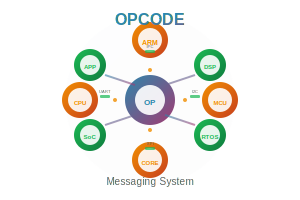
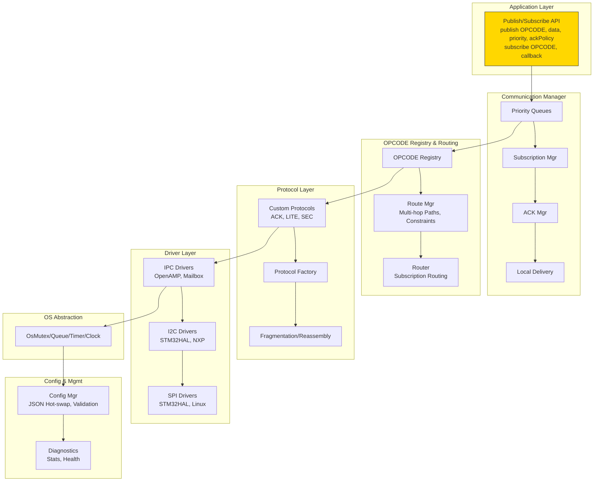
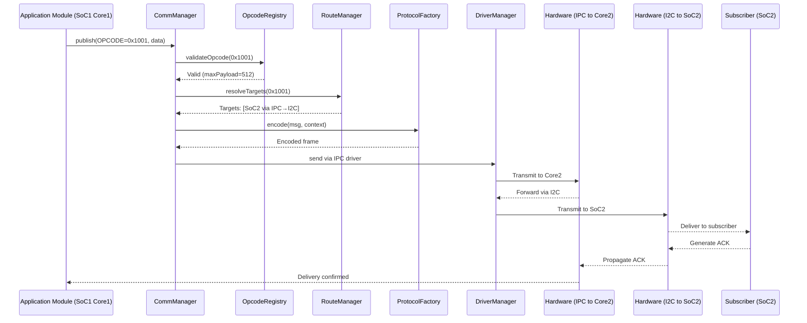

# OPCODE Messaging System

<div align="center">
  
  <br>
  <em>A robust, distributed messaging system for heterogeneous embedded platforms</em>
</div>

## Overview

The OPCODE Messaging System is a comprehensive communication framework designed for distributed embedded systems with multiple SoCs and heterogeneous cores (ARM, DSP, etc.). It provides a flexible, configurable messaging architecture based on the publish/subscribe pattern with OPCODE-centric routing.

This architecture enables modules to communicate via messages without knowledge of the underlying topology, making your system more modular and easier to maintain.

## Key Features

- **OPCODE-Centric Design**: Message routing based on OPCODEs rather than direct addressing
- **Multi-SoC Support**: Seamless communication across different processors and cores
- **Multiple Transport Layers**: Support for IPC, I2C, SPI, UART, and other interfaces
- **Configurable QoS**: Multiple priority levels with appropriate handling
- **Hot-Swappable Configuration**: Runtime reconfiguration with JSON-based definitions
- **Reliability Mechanisms**: Acknowledgments, retries, timeouts, and circuit breakers
- **Platform Independence**: Cross-platform compatibility (FreeRTOS, Linux, bare-metal)
- **Security Integration**: Authentication, encryption, and access control capabilities

## Architecture

The system follows a layered architecture with clear separation of responsibilities:



## Installation

### Prerequisites

- C++17 compatible compiler
- CMake 3.14 or higher
- Platform-specific dependencies:
  - For STM32: STM32CubeMX and appropriate HAL
  - For Linux: Standard development libraries

### Building

```bash
# Clone the repository
git clone https://github.com/yourusername/opcode-messaging-system.git
cd opcode-messaging-system

# Create and enter build directory
mkdir build && cd build

# Configure and build
cmake ..
make
```

## Basic Usage

### Initialization

```cpp
#include "msg/comm.hpp"
#include "msg/config.hpp"

// Initialize the messaging system
auto& commMgr = CommManager::getInstance();
ConfigManager configMgr(commMgr);

// Load configuration from JSON
configMgr.loadConfig("my_config.json");

// Register OPCODEs
opcodeRegistry->registerOpcode({
    0x0001, "SYS_HEARTBEAT", "System heartbeat", 
    16, Priority::LOW, AckPolicy::None, 1, false
});

// Start the system
commMgr.initialize();
```

### Publishing Messages

```cpp
// Create message
std::vector<uint8_t> sensorData = {0x01, 0x02, 0x03, 0x04};
Message msg{0x0300, sensorData};

// Set context with priority and acknowledgment
MessageContext ctx;
ctx.priority = Priority::HIGH;
ctx.ackPolicy = AckPolicy::RequireAck;
ctx.ackCallback = [](bool success) {
    if (success) {
        std::cout << "Message delivered successfully" << std::endl;
    }
};

// Publish message
commMgr.publish(msg, ctx);
```

### Subscribing to Messages

```cpp
// Subscribe to an OPCODE
commMgr.subscribe(0x0300, [](const Message& msg) {
    std::cout << "Received sensor data, size: " << msg.payload.size() << std::endl;
    // Process the message...
});
```

## Documentation

Detailed documentation can be found in the `docs` directory:

- [Core Architecture](docs/1-opcode-messaging-system.md)
- [Configuration Examples](docs/2-opcode-messaging-system-config.md)
- [Usage Examples & Best Practices](docs/3-opcode-messaging-system-usage.md)
- [Supplementary Information](docs/4-opcode-messaging-system-supplementary.md)
- [Manager Best Practices](docs/5-opcode-messaging-system-managers.md)
- [Advanced Visualization](docs/6-opcode-messaging-system-visualization.md)
- [Extended UML Design](docs/7-opcode-messaging-system-extended-uml.md)

## Multi-SoC Communication Flow

The diagram below illustrates the message flow across multiple SoCs:



## License

This project is licensed under the MIT License - see the [LICENSE](LICENSE) file for details.

## Contributing

Contributions are welcome! Please feel free to submit a Pull Request.

1. Fork the repository
2. Create your feature branch (`git checkout -b feature/amazing-feature`)
3. Commit your changes (`git commit -m 'Add some amazing feature'`)
4. Push to the branch (`git push origin feature/amazing-feature`)
5. Open a Pull Request
