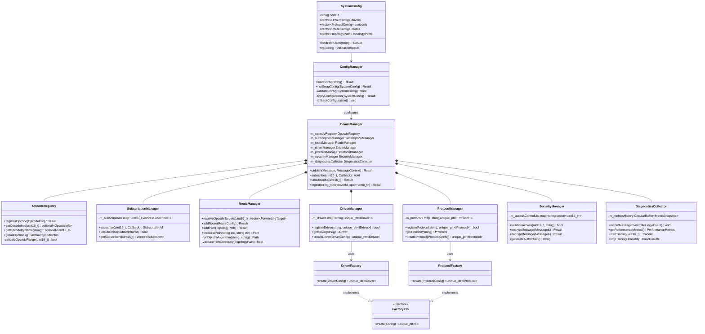

# OPCODE Messaging System - Core Architecture

## 1. Introduction and System Overview

This document presents a comprehensive design for a generic OPCODE-based messaging system for headset devices. The system is designed to be robust, distributed, and cross-platform, supporting multiple SoCs with heterogeneous cores (e.g., ARM, DSP) connected via various transports (IPC, I2C, SPI, etc.).

The core requirement is that sending and receiving messages are independent of the platform structure and compute-core placement. Modules publish messages to OPCODEs and subscribe to them, with routing handled transparently via subscriptions, not direct addressing.

### Key Design Principles

- **OPCODE-Centric Pub/Sub**: Messages use {OPCODE (16-bit), length, data}. Routing is based on subscriptions, decoupling modules from topology.
- **Platform Independence**: Abstractions for OS, drivers, protocols ensure portability (FreeRTOS, Linux, bare-metal).
- **Reliability & QoS**: Priorities (LOW/NORMAL/HIGH/URGENT), ACKs, fragmentation, retries, backpressure.
- **Configurability**: JSON/YAML for runtime hot-swap, with validation and rollback.
- **Scalability**: Multi-hop routing, capability constraints, factories for extensibility.

The design supports varying topologies (e.g., SoC1-3 with IPC/I2C/SPI links) without code changes—only config updates.

## 2. Top-Down Architecture

### 2.1 System Layers

The system is organized into the following layers (top to bottom):

1. **Application Layer**: Pub/sub API.
2. **Communication Manager**: Queuing, subscription handling, ACK management.
3. **OPCODE Registry & Routing**: OPCODE validation, multi-hop path resolution.
4. **Protocol Layer**: Encoding/decoding, fragmentation, security.
5. **Driver Layer**: Transport abstractions (IPC, I2C, SPI).
6. **OS Abstraction Layer**: Unified primitives (mutex, queue, timer).
7. **Configuration & Management**: Hot-swap, diagnostics.
8. **Platform/Hardware Layer**: Adapts to specific SoCs/cores.

### 2.2 Key Components

- **CommManager**: Central hub for publish/ingest operations
- **OpcodeRegistry**: Manages OPCODE metadata and validation
- **RouteManager (IRouter)**: Resolves subscription-based paths
- **ProtocolFactory/IProtocol**: Pluggable protocols (CUSTOM_ACK, etc.)
- **DriverManager/IDriver**: Variant drivers (e.g., I2C:STM32HAL)
- **ConfigManager**: Loads/validates/hot-swaps configurations
- **FactoryRegistry**: Creates drivers/protocols/managers based on configuration

### 2.3 Data Flow

- **Publish**: App → Queue (priority) → Validate OPCODE → Resolve subscribers/paths → Encode (protocol, fragment if > MTU) → Send (driver)
- **Receive**: Driver ingest → Decode → Reassemble/dedup → If forward: Re-encode & send next hop; else: Deliver callbacks
- **ACK**: Reverse path, preserving token
- **Config**: Load JSON → Validate (hash, capabilities) → Apply atomically → Rollback on fail

The flow handles multi-hop routing (e.g., SoC1 Core1 publish → IPC to Core2 → I2C to SoC2 Core1 → SPI to SoC3 Core1).

## 3. Block Diagram


## 4. Sequence Diagram: Multi-Hop OPCODE Publish with ACK

This diagram demonstrates publishing an OPCODE (e.g., 0x1001 SENSOR_DATA) from SoC1 Core1, routed via IPC to Core2, I2C to SoC2 Core1, SPI to SoC3 Core1, with ACK return path:


## 5. Extended Class Diagram


### 5.1 Explanation of Key Relations

- **Composition ("contains")**: CommManager owns OpcodeRegistry for validation
- **Usage ("uses")**: CommManager depends on IRouter for resolution, DriverManager for transmission
- **Inheritance ("implements")**: Concrete classes implement interfaces for pluggability
- **Creation**: Factories create instances via configuration (variant selection)
- **Configuration**: ConfigManager interacts with FactoryRegistry to instantiate components during hot-swap

## 6. Data Flow Diagram


## 7. Headers and Documentation

### 7.1 comm.hpp - Core API

```cpp
#ifndef MSG_COMM_HPP
#define MSG_COMM_HPP

#include <cstdint>
#include <functional>
#include <span>
#include <string_view>
#include <vector>
#include "msg/config.hpp"  // For Stats, Result, etc.

namespace msg {

/**
 * @brief Priority levels for QoS. URGENT preempts others, with starvation guard via deficit round-robin.
 * @note LOW for background, URGENT for critical (e.g., alerts). Independent of hardware—queues abstract delays.
 */
enum class Priority { LOW, NORMAL, HIGH, URGENT };

/**
 * @brief ACK policies. RequireAck ensures end-to-end delivery via tokens, even multi-hop.
 * @note None for fire-and-forget (e.g., telemetry). Thread-safe, with jittered retries.
 */
enum class AckPolicy { None, RequireAck };

/**
 * @brief Results. QueueFull triggers backpressure—caller retries or drops.
 */
enum class Result { Success, QueueFull, InvalidOpcode, Timeout, ConfigurationInvalid };

/**
 * @brief Message structure. OPCODE decouples from topology—publish without knowing receivers.
 */
struct Message {
    uint16_t opcode;
    std::span<const uint8_t> payload;
};

/**
 * @brief Context for publish. ackCallback called on ACK/fail (end-to-end).
 * @example MessageContext ctx; ctx.priority = Priority::URGENT; ctx.ackCallback = [](bool ok){};
 */
struct MessageContext {
    Priority priority = Priority::NORMAL;
    AckPolicy ackPolicy = AckPolicy::None;
    std::function<void(bool)> ackCallback = nullptr;
};

/**
 * @brief Stats for diagnostics. Errors include CRC fails, timeouts.
 * @note Query periodically for health monitoring. Platform-independent.
 */
struct Stats {
    uint64_t txMessages = 0;
    uint64_t rxMessages = 0;
    uint64_t errors = 0;
    uint64_t retries = 0;
    uint32_t avgLatencyUs = 0;
};

/**
 * @class CommManager
 * @brief Core messaging hub. Handles pub/sub, routing, independent of cores/topology.
 * @note Thread-safe. Ingest from drivers in ISR/task. Config via ConfigManager for hot-swap.
 * @example CommManager cm; cm.publish({0x1001, dataSpan}); // Routes to subscribers automatically.
 */
class CommManager {
public:
    /**
     * @brief Publish to OPCODE. Routes to subscribers via multi-hop if needed, with frag/ACK.
     * @param msg Message.
     * @param ctx Context.
     * @return Result. noexcept for hot paths.
     * @note Independent: No NodeId—OPCODE registry/router handle delivery.
     */
    Result publish(const Message& msg, const MessageContext& ctx = {}) noexcept;

    /**
     * @brief Subscribe callback to OPCODE. Multiple allowed, fan-out in order.
     * @param opcode OPCODE.
     * @param cb Callback (invoked in processing thread, not ISR).
     * @note Thread-safe. Unsubscribe to remove.
     */
    void subscribe(uint16_t opcode, std::function<void(const Message&)> cb);

    /**
     * @brief Unsubscribe from OPCODE.
     * @param opcode OPCODE.
     * @return Result.
     */
    Result unsubscribe(uint16_t opcode);

    /**
     * @brief Get stats.
     * @return Stats.
     * @note noexcept, low overhead.
     */
    Stats getStatistics() const noexcept;

    /**
     * @brief Ingest frame from driver. Decodes, reassembles, forwards/delivers.
     * @param driverId Driver ID.
     * @param data Frame.
     * @return Result. noexcept, ISR-safe with lock-free.
     * @note Handles forward (re-encode/send) or local delivery.
     */
    Result ingest(std::string_view driverId, std::span<const uint8_t> data) noexcept;
};

} // namespace msg

#endif
```

### 7.2 opcode_registry.hpp - OPCODE Management

```cpp
#ifndef MSG_OPCODE_REGISTRY_HPP
#define MSG_OPCODE_REGISTRY_HPP

#include <string>
#include <optional>
#include <vector>

namespace msg {

/**
 * @struct OpcodeInfo
 * @brief OPCODE metadata.
 */
struct OpcodeInfo {
    uint16_t opcode;
    std::string name;
    std::string description;
    uint32_t maxPayloadSize;
    Priority defaultPriority;
    AckPolicy defaultAckPolicy;
    uint32_t version;
    bool deprecated = false;
};

/**
 * @class OpcodeRegistry
 * @brief Registers and queries OPCODEs.
 * @note Version for compatibility; deprecated for migration.
 */
class OpcodeRegistry {
public:
    Result registerOpcode(const OpcodeInfo& info);
    std::optional<OpcodeInfo> getOpcodeInfo(uint16_t opcode) const;
    std::optional<uint16_t> getOpcodeByName(const std::string& name) const;
    std::vector<OpcodeInfo> getAllOpcodes() const;
};

}  // namespace msg

#endif
```

### 7.3 config.hpp - Configuration

```cpp
#ifndef MSG_CONFIG_HPP
#define MSG_CONFIG_HPP

#include <string>
#include <vector>
#include <map>

namespace msg {

/**
 * @struct DriverConfig
 * @brief Driver setup.
 */
struct DriverConfig {
    std::string id;
    std::string type;    // e.g., "IPC"
    std::string variant; // e.g., "OpenAMP"
    std::map<std::string, std::string> settings;
    std::map<std::string, std::string> capabilities;
    std::string driverId;
};

/**
 * @struct ProtocolConfig
 * @brief Protocol setup.
 */
struct ProtocolConfig {
    std::string id;
    std::string type; // e.g., "CUSTOM_ACK"
    std::map<std::string, std::string> settings;
};

/**
 * @struct RouteConfig
 * @brief Route setup.
 */
struct RouteConfig {
    std::string id;
    std::string src;
    std::string dst;
    std::string driverId;
    std::string protocolId;
    Priority priority = Priority::NORMAL;
    AckPolicy ackPolicy = AckPolicy::None;
    std::vector<std::string> requiresCaps;
};

/**
 * @struct TopologyPath
 * @brief Multi-hop path.
 */
struct TopologyPath {
    std::string destination;
    std::vector<std::string> hops;
    uint32_t totalCost;
    std::vector<std::string> backup;
};

/**
 * @struct SystemConfig
 * @brief Full config.
 */
struct SystemConfig {
    std::string nodeId;
    std::vector<DriverConfig> drivers;
    std::vector<ProtocolConfig> protocols;
    std::vector<RouteConfig> routes;
    std::vector<TopologyPath> topologyPaths;
    std::string hash; // Validation hash
};

/**
 * @class ConfigManager
 * @brief Handles config loading/hot-swap.
 * @note Validation checks hash, capabilities (e.g., maxFrame>=256 parsed as >=).
 *       Hot-swap is atomic—no message loss.
 */
class ConfigManager {
public:
    Result loadConfig(const std::string& filePath);
    Result hotSwapConfig(const SystemConfig& newConfig); // Atomic, with rollback
};

}  // namespace msg

#endif
```

### 7.4 driver.hpp - Driver Interface

```cpp
#ifndef MSG_DRIVER_HPP
#define MSG_DRIVER_HPP

#include <span>
#include <map>
#include <string>

namespace msg {

/**
 * @struct DriverCapabilities
 * @brief Driver features.
 */
struct DriverCapabilities {
    std::map<std::string, std::string> caps; // e.g., {"maxFrame", "256"}
};

/**
 * @class IDriver
 * @brief Driver interface.
 * @note getCapabilities returns map for router constraints.
 *       Variants (e.g., STM32HAL) selected via factory.
 */
class IDriver {
public:
    virtual ~IDriver() = default;
    virtual Result initialize() = 0;
    virtual Result send(std::span<const uint8_t> data) noexcept = 0;
    virtual Result receive(std::vector<uint8_t>& data, uint32_t timeoutMs = 0) noexcept = 0;
    virtual DriverCapabilities getCapabilities() const = 0;
    virtual void shutdown() = 0;
};

}  // namespace msg

#endif
```

### 7.5 protocol.hpp - Protocol Interface

```cpp
#ifndef MSG_PROTOCOL_HPP
#define MSG_PROTOCOL_HPP

#include <span>
#include <vector>

namespace msg {

/**
 * @struct ProtocolMeta
 * @brief Decode metadata.
 */
struct ProtocolMeta {
    bool isForwarded = false;
    std::string finalDestination;
    // ... (token, hopCount, etc.)
};

/**
 * @class IProtocol
 * @brief Protocol interface.
 * @note encode/decode handles fragmentation (segIdx/segCnt), forward (dst field).
 *       CUSTOM_ACK preserves token multi-hop.
 */
class IProtocol {
public:
    virtual ~IProtocol() = default;
    virtual Result encode(const Message& msg, std::vector<uint8_t>& output) = 0;
    virtual Result decode(std::span<const uint8_t> data, Message& msg, ProtocolMeta& meta) = 0;
    virtual Result encodeAck(uint32_t token, std::vector<uint8_t>& output) = 0;
};

}  // namespace msg

#endif
```

### 7.6 router.hpp - Router Interface

```cpp
#ifndef MSG_ROUTER_HPP
#define MSG_ROUTER_HPP

#include <string>
#include <vector>

namespace msg {

/**
 * @struct ForwardingTarget
 * @brief Routing target.
 */
struct ForwardingTarget {
    std::string nextHop;
    std::string driverId;
    std::string protocolId;
    std::string finalDestination;
    std::vector<std::string> remainingHops;
};

/**
 * @class IRouter
 * @brief Routing interface.
 * @note resolveOpcodeTargets returns targets with hops.
 *       Constraints parsed (e.g., 'dma==true' or 'latency<100').
 */
class IRouter {
public:
    virtual ~IRouter() = default;
    virtual std::vector<ForwardingTarget> resolveOpcodeTargets(uint16_t opcode) = 0;
    virtual Result addRoute(const RouteConfig& route) = 0;
    virtual Result addPath(const TopologyPath& path) = 0;
};

}  // namespace msg

#endif
```

### 7.7 os_abstraction.hpp - OS Abstractions

```cpp
#ifndef MSG_OS_ABSTRACTION_HPP
#define MSG_OS_ABSTRACTION_HPP

#include <cstdint>
#include <functional>
#include <queue>

namespace msg {

/**
 * @class OsMutex
 * @brief Mutex abstraction.
 * @note Unified for platforms. Platform-specific implementation in source files.
 */
class OsMutex {
public:
    void lock() noexcept;
    void unlock() noexcept;
    // ... (platform-impl in src)
};

/**
 * @class OsQueue
 * @brief Thread-safe queue.
 * @note OsQueue lock-free for ISR safety on embedded platforms.
 */
template <typename T>
class OsQueue {
public:
    bool push(const T& item, uint32_t timeoutMs = 0) noexcept;
    bool pop(T& item, uint32_t timeoutMs = 0) noexcept;
    // ...
};

/**
 * @class OsClock
 * @brief Monotonic clock.
 */
class OsClock {
public:
    static uint64_t nowMicros() noexcept;
};

/**
 * @class OsTimer
 * @brief Timer abstraction.
 * @note OsTimer uses HW timers where possible.
 */
class OsTimer {
public:
    using Callback = std::function<void()>;
    OsTimer(uint32_t intervalMs, bool periodic, Callback cb);
    void start() noexcept;
    void stop() noexcept;
};

}  // namespace msg

#endif
```

### 7.8 utils.hpp - Utilities

```cpp
#ifndef MSG_UTILS_HPP
#define MSG_UTILS_HPP

#include <cstdint>
#include <span>

namespace msg {

/**
 * @brief CRC16 calculation (ANSI polynomial).
 * @param data Data span.
 * @return CRC value.
 * @note Used in protocols for integrity. Hook for hardware acceleration if available.
 */
uint16_t calculateCRC16(std::span<const uint8_t> data);

}  // namespace msg

#endif
```

## 8. Platform Configuration Examples

### 8.1 Premium Headset Product Line

```json
{
  "productId": "PremiumIntercom-2025",
  "systemTopology": {
    "mainSoC": {
      "id": "QCC5144",
      "cores": [
        {
          "id": "ARM_M4",
          "type": "Cortex-M4F",
          "clockMhz": 120,
          "modules": ["ConnectivityManager", "UIController", "SystemMonitor"]
        },
        {
          "id": "DSP_1",
          "type": "Kalimba",
          "clockMhz": 200,
          "modules": ["AudioProcessor", "NoiseReduction", "VoiceRecognition"]
        }
      ],
      "internalConnections": [
        {
          "source": "ARM_M4",
          "destination": "DSP_1",
          "type": "SharedMemory",
          "bandwidth": "80MB/s"
        }
      ]
    },
    "bleSoC": {
      "id": "nRF52832",
      "cores": [
        {
          "id": "BLE_CORE",
          "type": "Cortex-M4",
          "clockMhz": 64,
          "modules": ["BLEStack", "PairingManager"]
        }
      ]
    },
    "sensorSoC": {
      "id": "STM32L4",
      "cores": [
        {
          "id": "SENSOR_CORE",
          "type": "Cortex-M4",
          "clockMhz": 80,
          "modules": ["MotionSensor", "EnvironmentalSensor"]
        }
      ]
    },
    "externalConnections": [
      {
        "source": "mainSoC.ARM_M4",
        "destination": "bleSoC.BLE_CORE",
        "type": "UART",
        "baudRate": 921600
      },
      {
        "source": "mainSoC.ARM_M4",
        "destination": "sensorSoC.SENSOR_CORE",
        "type": "I2C",
        "speed": "Fast",
        "address": "0x42"
      }
    ]
  }
}
```

### 8.2 Initialization Sequence


## 9. Security and Resource Management

### 9.1 Cross-Core Security Model

The messaging system implements a layered security model:

1. **Module Access Control**
   - OPCODEs are grouped into security domains (System, Audio, User)
   - Modules must be authorized to publish/subscribe to specific OPCODE ranges

2. **Transport Security**
   - IPC communications use hardware-protected shared memory regions
   - External transports (UART, I2C) support message encryption
   - Message authentication prevents tampering

3. **Resource Quotas**
   - Per-module memory allocation limits
   - Rate limiting for high-volume publishers
   - Prioritized scheduling based on message types

### 9.2 Resource Management

```cpp
// Example resource quota configuration
struct ResourceQuotas {
    // Memory quotas in bytes
    uint32_t maxQueueMemoryPerPriority[4] = {
        16384,  // URGENT
        8192,   // HIGH
        4096,   // NORMAL
        2048    // LOW
    };

    // Rate limits (messages per second)
    uint32_t maxPublishRatePerPriority[4] = {
        1000,   // URGENT
        500,    // HIGH
        200,    // NORMAL
        50      // LOW
    };

    // CPU time allocation (percentage)
    uint8_t processingTimePercentage[4] = {
        50,     // URGENT
        30,     // HIGH
        15,     // NORMAL
        5       // LOW
    };
};
```

## 10. Diagnostic System Integration

The messaging system includes comprehensive diagnostics:

1. **Performance Metrics**
   - End-to-end latency tracking
   - Throughput monitoring
   - Error rate detection

2. **Debug Interface**
   - Live inspection of routing tables
   - Message tracing across cores
   - Configuration validation tools

3. **Health Monitoring**
   - Watchdog integration
   - Communication link health checks
   - Automatic recovery mechanisms

### Additional Class Diagram Enhancements

More detailed class diagram showing the relationships between configuration components and actual runtime components:



These additions provide the more detailed configuration examples and component relationships.
