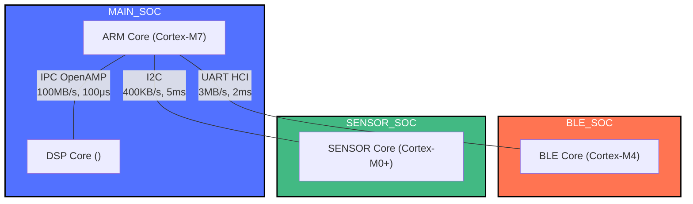
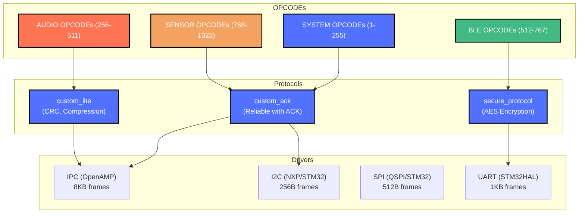

# OPCODE Messaging System - Configuration Examples

## 1. Basic Node Configurations

### 1.1 SoC1 Core2 (Gateway Node)

```json
{
  "nodeId": "SoC1_Core2",
  "drivers": [
    {
      "id": "ipc_soc1",
      "type": "IPC",
      "variant": "Mailbox",
      "settings": { "queueSize": "64" },
      "capabilities": { "maxFrame": "1024", "async": "true", "dma": "false" }
    },
    {
      "id": "i2c_to_soc2",
      "type": "I2C",
      "variant": "STM32HAL",
      "settings": { "interface": "I2C1", "speed": "400000", "address": "0x42" },
      "capabilities": { "maxFrame": "256", "dma": "true", "latency": "200" }
    },
    {
      "id": "spi_to_soc3",
      "type": "SPI",
      "variant": "STM32HAL",
      "settings": { "interface": "SPI1", "speed": "10000000", "mode": "0" },
      "capabilities": { "maxFrame": "512", "async": "true", "dma": "true" }
    }
  ],
  "protocols": [
    {
      "id": "custom_ack",
      "type": "CUSTOM_ACK",
      "settings": { "ackTimeout": "500", "maxRetries": "3", "backoffMultiplier": "2.0" }
    },
    {
      "id": "custom_lite",
      "type": "CUSTOM_LITE",
      "settings": { "enableCRC": "true" }
    }
  ],
  "routes": [
    {
      "id": "route_internal_ipc",
      "src": "SoC1_Core1",
      "dst": "SoC1_Core2",
      "driverId": "ipc_soc1",
      "protocolId": "custom_lite",
      "priority": "NORMAL",
      "ackPolicy": "None",
      "requiresCaps": ["maxFrame>=512"]
    },
    {
      "id": "route_to_soc2",
      "src": "SoC1_Core2",
      "dst": "SoC2_Core1",
      "driverId": "i2c_to_soc2",
      "protocolId": "custom_ack",
      "priority": "HIGH",
      "ackPolicy": "RequireAck",
      "requiresCaps": ["dma==true", "latency<300"]
    },
    {
      "id": "route_to_soc3",
      "src": "SoC1_Core2",
      "dst": "SoC3_Core1",
      "driverId": "spi_to_soc3",
      "protocolId": "custom_ack",
      "priority": "URGENT",
      "ackPolicy": "RequireAck",
      "requiresCaps": ["async==true", "maxFrame>256"]
    }
  ],
  "topologyPaths": [
    {
      "destination": "SoC2_Core2",
      "hops": ["route_to_soc2"],
      "totalCost": 10,
      "backup": ["route_backup_i2c"]
    },
    {
      "destination": "SoC3_Core1",
      "hops": ["route_to_soc3"],
      "totalCost": 15,
      "backup": []
    }
  ],
  "qos": {
    "urgentTimeoutMs": 1000,
    "highRetryMs": 200,
    "normalRetryMs": 500,
    "lowRetryMs": 2000
  },
  "hash": "sha256:1a2b3c4d5e6f7890abcdef1234567890"
}
```

### 1.2 SoC2 Core1 (Intermediate Node)

```json
{
  "nodeId": "SoC2_Core1",
  "drivers": [
    {
      "id": "i2c_from_soc1",
      "type": "I2C",
      "variant": "STM32HAL",
      "settings": { "interface": "I2C1", "mode": "slave", "address": "0x42" },
      "capabilities": { "maxFrame": "256", "dma": "true" }
    },
    {
      "id": "internal_soc2",
      "type": "IPC",
      "variant": "Mailbox",
      "settings": { "queueSize": "32" },
      "capabilities": { "maxFrame": "512", "async": "true" }
    }
  ],
  "protocols": [
    {
      "id": "custom_ack",
      "type": "CUSTOM_ACK",
      "settings": { "ackTimeout": "500", "maxRetries": "3" }
    }
  ],
  "routes": [
    {
      "id": "route_from_soc1",
      "src": "SoC1_Core2",
      "dst": "SoC2_Core1",
      "driverId": "i2c_from_soc1",
      "protocolId": "custom_ack",
      "priority": "HIGH",
      "ackPolicy": "RequireAck",
      "requiresCaps": ["dma==true"]
    },
    {
      "id": "route_internal_soc2",
      "src": "SoC2_Core1",
      "dst": "SoC2_Core2",
      "driverId": "internal_soc2",
      "protocolId": "custom_ack",
      "priority": "NORMAL",
      "ackPolicy": "RequireAck",
      "requiresCaps": ["async==true"]
    }
  ],
  "topologyPaths": [],
  "qos": {
    "urgentTimeoutMs": 1000,
    "highRetryMs": 200,
    "normalRetryMs": 500,
    "lowRetryMs": 2000
  },
  "hash": "sha256:abcdef9876543210fedcba0987654321"
}
```

### 1.3 SoC3 Core1 (Endpoint Node)

```json
{
  "nodeId": "SoC3_Core1",
  "drivers": [
    {
      "id": "spi_from_soc1",
      "type": "SPI",
      "variant": "STM32HAL",
      "settings": { "interface": "SPI1", "mode": "slave" },
      "capabilities": { "maxFrame": "512", "dma": "true" }
    }
  ],
  "protocols": [
    {
      "id": "custom_ack",
      "type": "CUSTOM_ACK",
      "settings": { "ackTimeout": "500", "maxRetries": "3" }
    }
  ],
  "routes": [
    {
      "id": "route_from_soc1",
      "src": "SoC1_Core2",
      "dst": "SoC3_Core1",
      "driverId": "spi_from_soc1",
      "protocolId": "custom_ack",
      "priority": "URGENT",
      "ackPolicy": "RequireAck",
      "requiresCaps": ["dma==true"]
    }
  ],
  "topologyPaths": [],
  "qos": {
    "urgentTimeoutMs": 1000,
    "highRetryMs": 200,
    "normalRetryMs": 500,
    "lowRetryMs": 2000
  },
  "hash": "sha256:1234567890abcdef fedcba9876543210"
}
```

## 2. Advanced Production Configuration Examples

### 2.1 Audio Processing Headset Configuration with OPCODE Mapping

This configuration demonstrates a premium headset product with detailed OPCODE mappings, QoS settings, and security features:

```json
{
  "nodeId": "DSP_Core",
  "systemType": "Premium_Headset_2025",
  "platformGeneration": "Gen4",
  "opcodeRanges": [
    {
      "name": "SYSTEM",
      "rangeStart": 1,
      "rangeEnd": 255,
      "description": "System management OPCODEs",
      "securityLevel": "PROTECTED"
    },
    {
      "name": "AUDIO",
      "rangeStart": 256,
      "rangeEnd": 511,
      "description": "Audio processing OPCODEs",
      "securityLevel": "NORMAL"
    },
    {
      "name": "BLE",
      "rangeStart": 512,
      "rangeEnd": 767,
      "description": "Bluetooth related OPCODEs",
      "securityLevel": "PROTECTED"
    },
    {
      "name": "SENSOR",
      "rangeStart": 768,
      "rangeEnd": 1023,
      "description": "Sensor related OPCODEs",
      "securityLevel": "NORMAL"
    },
    {
      "name": "USER_APP",
      "rangeStart": 4096,
      "rangeEnd": 8191,
      "description": "User application OPCODEs",
      "securityLevel": "RESTRICTED"
    }
  ],
  "opcodes": [
    {
      "opcode": 1,
      "name": "SYS_HEARTBEAT",
      "description": "System heartbeat for health monitoring",
      "maxPayloadSize": 16,
      "defaultPriority": "LOW",
      "defaultAckPolicy": "None",
      "version": 1,
      "deprecated": false,
      "subscribers": ["CONN_MGR", "HEALTH_MON"]
    },
    {
      "opcode": 2,
      "name": "SYS_POWER_STATE",
      "description": "Power state changes",
      "maxPayloadSize": 8,
      "defaultPriority": "HIGH",
      "defaultAckPolicy": "RequireAck",
      "version": 2,
      "deprecated": false,
      "subscribers": ["ALL"]
    },
    {
      "opcode": 256,
      "name": "AUDIO_PCM_STREAM",
      "description": "Raw PCM audio stream",
      "maxPayloadSize": 4096,
      "defaultPriority": "URGENT",
      "defaultAckPolicy": "None",
      "version": 1,
      "deprecated": false,
      "subscribers": ["DSP_PROC", "CODEC"]
    },
    {
      "opcode": 257,
      "name": "AUDIO_EQ_SETTINGS",
      "description": "Equalizer settings",
      "maxPayloadSize": 128,
      "defaultPriority": "NORMAL",
      "defaultAckPolicy": "RequireAck",
      "version": 3,
      "deprecated": false,
      "subscribers": ["DSP_PROC"]
    },
    {
      "opcode": 512,
      "name": "BLE_CONNECTION_STATE",
      "description": "BLE connection state changes",
      "maxPayloadSize": 32,
      "defaultPriority": "HIGH",
      "defaultAckPolicy": "RequireAck",
      "version": 1,
      "deprecated": false,
      "subscribers": ["CONN_MGR", "UI_CTRL"]
    },
    {
      "opcode": 768,
      "name": "SENSOR_ACCEL_DATA",
      "description": "Accelerometer data",
      "maxPayloadSize": 64,
      "defaultPriority": "LOW",
      "defaultAckPolicy": "None",
      "version": 2,
      "deprecated": false,
      "subscribers": ["GESTURE_REC"]
    }
  ],
  "drivers": [
    {
      "id": "ipc_dsp_arm",
      "type": "IPC",
      "variant": "OpenAMP",
      "settings": {
        "queueSize": "128",
        "sharedMemSize": "32768",
        "interruptLine": "7"
      },
      "capabilities": {
        "maxFrame": "8192",
        "async": "true",
        "dma": "true",
        "latency": "50"
      },
      "powerMode": {
        "activePowerMw": "5",
        "idlePowerMw": "0.5",
        "wakeupTimeUs": "100"
      }
    },
    {
      "id": "i2c_sensors",
      "type": "I2C",
      "variant": "NXP_LPI2C",
      "settings": {
        "interface": "I2C2",
        "speed": "1000000",
        "address": "0x42",
        "pullups": "enabled"
      },
      "capabilities": {
        "maxFrame": "256",
        "dma": "true",
        "latency": "150",
        "concurrentTransactions": "false"
      },
      "powerMode": {
        "activePowerMw": "3",
        "idlePowerMw": "0.1",
        "wakeupTimeUs": "50"
      }
    },
    {
      "id": "spi_flash",
      "type": "SPI",
      "variant": "QSPI_STM32",
      "settings": {
        "interface": "QSPI1",
        "speed": "50000000",
        "mode": "0",
        "dataWidth": "4"
      },
      "capabilities": {
        "maxFrame": "4096",
        "dma": "true",
        "async": "true",
        "latency": "100"
      },
      "powerMode": {
        "activePowerMw": "15",
        "idlePowerMw": "0.2",
        "wakeupTimeUs": "200"
      }
    },
    {
      "id": "uart_debug",
      "type": "UART",
      "variant": "STM32HAL",
      "settings": {
        "interface": "UART1",
        "baudRate": "2000000",
        "parity": "none",
        "stopBits": "1"
      },
      "capabilities": {
        "maxFrame": "1024",
        "dma": "true",
        "flowControl": "true"
      },
      "powerMode": {
        "activePowerMw": "7",
        "idlePowerMw": "0.3",
        "wakeupTimeUs": "50"
      }
    }
  ],
  "protocols": [
    {
      "id": "custom_ack",
      "type": "CUSTOM_ACK",
      "settings": {
        "ackTimeout": "500",
        "maxRetries": "3",
        "backoffMultiplier": "2.0",
        "enableCRC": "true",
        "useEncryption": "false"
      }
    },
    {
      "id": "custom_lite",
      "type": "CUSTOM_LITE",
      "settings": {
        "enableCRC": "true",
        "useEncryption": "false",
        "headerCompression": "true"
      }
    },
    {
      "id": "secure_protocol",
      "type": "SECURE_AES",
      "settings": {
        "ackTimeout": "1000",
        "maxRetries": "5",
        "backoffMultiplier": "1.5",
        "enableCRC": "true",
        "useEncryption": "true",
        "encryptionKeyId": "system_aes_key_1",
        "authenticationEnabled": "true",
        "authenticationMethod": "HMAC_SHA256"
      }
    }
  ],
  "routes": [
    {
      "id": "route_audio_dsp_arm",
      "src": "DSP_Core",
      "dst": "ARM_Core",
      "driverId": "ipc_dsp_arm",
      "protocolId": "custom_lite",
      "priority": "URGENT",
      "ackPolicy": "None",
      "requiresCaps": ["maxFrame>=4096", "latency<100"],
      "opcodePatterns": ["256-511"],
      "qosProfile": "AUDIO_STREAM"
    },
    {
      "id": "route_system_dsp_arm",
      "src": "DSP_Core",
      "dst": "ARM_Core",
      "driverId": "ipc_dsp_arm",
      "protocolId": "custom_ack",
      "priority": "HIGH",
      "ackPolicy": "RequireAck",
      "requiresCaps": ["dma==true"],
      "opcodePatterns": ["1-255", "512-767"],
      "qosProfile": "SYSTEM_CRITICAL"
    },
    {
      "id": "route_sensor_arm_dsp",
      "src": "ARM_Core",
      "dst": "DSP_Core",
      "driverId": "ipc_dsp_arm",
      "protocolId": "custom_ack",
      "priority": "NORMAL",
      "ackPolicy": "RequireAck",
      "requiresCaps": ["async==true"],
      "opcodePatterns": ["768-1023"],
      "qosProfile": "SENSOR_DATA"
    },
    {
      "id": "route_ble_secure",
      "src": "BLE_Core",
      "dst": "ARM_Core",
      "driverId": "uart_ble",
      "protocolId": "secure_protocol",
      "priority": "HIGH",
      "ackPolicy": "RequireAck",
      "requiresCaps": ["flowControl==true", "dma==true"],
      "opcodePatterns": ["512-767"],
      "qosProfile": "SECURITY_CRITICAL"
    }
  ],
  "topologyPaths": [
    {
      "destination": "ARM_Core",
      "hops": ["route_audio_dsp_arm"],
      "totalCost": 5,
      "backup": [],
      "qosRequirements": {
        "maxLatencyMs": 5,
        "minBandwidthKbps": 768,
        "reliability": "HIGH"
      }
    },
    {
      "destination": "DSP_Core",
      "hops": ["route_sensor_arm_dsp"],
      "totalCost": 5,
      "backup": [],
      "qosRequirements": {
        "maxLatencyMs": 20,
        "minBandwidthKbps": 128,
        "reliability": "MEDIUM"
      }
    },
    {
      "destination": "SENSOR_HUB",
      "hops": ["route_system_dsp_arm", "route_arm_sensor"],
      "totalCost": 15,
      "backup": ["route_direct_sensor"],
      "qosRequirements": {
        "maxLatencyMs": 50,
        "minBandwidthKbps": 64,
        "reliability": "LOW"
      }
    }
  ],
  "qosProfiles": [
    {
      "id": "AUDIO_STREAM",
      "description": "Real-time audio streaming profile",
      "urgentTimeoutMs": 10,
      "highRetryMs": 5,
      "normalRetryMs": 20,
      "lowRetryMs": 50,
      "resourceReservation": {
        "cpuPercentage": 30,
        "memoryKb": 1024,
        "priorityBoost": true
      },
      "circuitBreaker": {
        "errorThreshold": 10,
        "windowMs": 1000,
        "tripTimeMs": 5000
      }
    },
    {
      "id": "SYSTEM_CRITICAL",
      "description": "Critical system operations",
      "urgentTimeoutMs": 500,
      "highRetryMs": 100,
      "normalRetryMs": 200,
      "lowRetryMs": 500,
      "resourceReservation": {
        "cpuPercentage": 10,
        "memoryKb": 512,
        "priorityBoost": true
      },
      "circuitBreaker": {
        "errorThreshold": 5,
        "windowMs": 2000,
        "tripTimeMs": 10000
      }
    },
    {
      "id": "SENSOR_DATA",
      "description": "Regular sensor data transmission",
      "urgentTimeoutMs": 2000,
      "highRetryMs": 500,
      "normalRetryMs": 1000,
      "lowRetryMs": 5000,
      "resourceReservation": {
        "cpuPercentage": 5,
        "memoryKb": 256,
        "priorityBoost": false
      },
      "circuitBreaker": {
        "errorThreshold": 50,
        "windowMs": 10000,
        "tripTimeMs": 30000
      }
    },
    {
      "id": "SECURITY_CRITICAL",
      "description": "Security sensitive operations",
      "urgentTimeoutMs": 800,
      "highRetryMs": 200,
      "normalRetryMs": 400,
      "lowRetryMs": 1000,
      "resourceReservation": {
        "cpuPercentage": 15,
        "memoryKb": 768,
        "priorityBoost": true
      },
      "circuitBreaker": {
        "errorThreshold": 3,
        "windowMs": 5000,
        "tripTimeMs": 60000
      }
    }
  ],
  "subscriptionMappings": [
    {
      "module": "CONN_MGR",
      "core": "ARM_Core",
      "opcodes": [1, 2, 512, 513],
      "priority": "HIGH"
    },
    {
      "module": "DSP_PROC",
      "core": "DSP_Core",
      "opcodes": [256, 257, 258],
      "priority": "URGENT"
    },
    {
      "module": "GESTURE_REC",
      "core": "DSP_Core",
      "opcodes": [768, 769, 770],
      "priority": "NORMAL"
    },
    {
      "module": "UI_CTRL",
      "core": "ARM_Core",
      "opcodes": [512, 2],
      "priority": "NORMAL"
    },
    {
      "module": "HEALTH_MON",
      "core": "ARM_Core",
      "opcodes": [1, 768],
      "priority": "LOW"
    }
  ],
  "security": {
    "encryptionKeys": [
      {
        "id": "system_aes_key_1",
        "type": "AES-256",
        "storageMethod": "TEE",
        "rotationPeriodDays": 30,
        "allowedModules": ["CONN_MGR", "SECURITY_MGR"]
      }
    ],
    "accessControl": {
      "opcodeRestrictions": [
        {
          "opcodeRange": "1-255",
          "allowedModules": ["SYSTEM", "CONN_MGR", "HEALTH_MON"]
        },
        {
          "opcodeRange": "512-767",
          "allowedModules": ["CONN_MGR", "SECURITY_MGR", "UI_CTRL"]
        }
      ]
    }
  },
  "diagnostics": {
    "metrics": [
      {
        "name": "msg_throughput",
        "description": "Messages per second",
        "unit": "msgs/sec",
        "threshold": 1000,
        "severity": "WARNING"
      },
      {
        "name": "error_rate",
        "description": "Message error rate",
        "unit": "percent",
        "threshold": 5,
        "severity": "ERROR"
      },
      {
        "name": "avg_latency",
        "description": "Average message latency",
        "unit": "ms",
        "threshold": 50,
        "severity": "WARNING"
      }
    ],
    "logging": {
      "opcodeGroups": [
        {
          "name": "SYSTEM",
          "level": "INFO"
        },
        {
          "name": "AUDIO",
          "level": "ERROR"
        },
        {
          "name": "BLE",
          "level": "DEBUG"
        }
      ]
    }
  },
  "hash": "sha256:1a2b3c4d5e6f7890abcdef1234567890abcdef1234567890"
}
```

### 2.2 Multi-SoC System-Level Configuration

This configuration defines the relationships between multiple SoCs in a complete headset system:

```json
{
  "systemName": "Premium_Headset_Mark3",
  "version": "1.2.0",
  "configGenerationDate": "2025-08-12T23:08:14Z",
  "socs": [
    {
      "socId": "MAIN_SOC",
      "description": "Main application processor",
      "cores": [
        {
          "coreId": "ARM_Core",
          "type": "Cortex-M7",
          "clockMhz": 400,
          "modules": ["CONN_MGR", "UI_CTRL", "HEALTH_MON", "SECURITY_MGR"]
        },
        {
          "coreId": "DSP_Core",
          "type": "Tensilica HiFi4",
          "clockMhz": 600,
          "modules": ["DSP_PROC", "AUDIO_CODEC", "GESTURE_REC", "EQ_MODULE"]
        }
      ]
    },
    {
      "socId": "BLE_SOC",
      "description": "Bluetooth connectivity processor",
      "cores": [
        {
          "coreId": "BLE_Core",
          "type": "Cortex-M4",
          "clockMhz": 64,
          "modules": ["BLE_STACK", "BLE_PROFILES", "PAIRING_MGR"]
        }
      ]
    },
    {
      "socId": "SENSOR_SOC",
      "description": "Sensor hub with low power core",
      "cores": [
        {
          "coreId": "SENSOR_Core",
          "type": "Cortex-M0+",
          "clockMhz": 32,
          "modules": ["SENSOR_MGR", "MOTION_DETECT", "POWER_MGR"]
        }
      ]
    }
  ],
  "connections": [
    {
      "src": "MAIN_SOC.ARM_Core",
      "dst": "MAIN_SOC.DSP_Core",
      "type": "IPC",
      "protocol": "OpenAMP",
      "bandwidth": "100MB/s",
      "latency": "100us",
      "powerConsumption": "Low"
    },
    {
      "src": "MAIN_SOC.ARM_Core",
      "dst": "BLE_SOC.BLE_Core",
      "type": "UART",
      "protocol": "HCI",
      "bandwidth": "3MB/s",
      "latency": "2ms",
      "powerConsumption": "Medium"
    },
    {
      "src": "MAIN_SOC.ARM_Core",
      "dst": "SENSOR_SOC.SENSOR_Core",
      "type": "I2C",
      "protocol": "Standard",
      "bandwidth": "400KB/s",
      "latency": "5ms",
      "powerConsumption": "VeryLow"
    }
  ],
  "opcodeCategories": [
    {
      "name": "SYSTEM_CONTROL",
      "description": "System management and control opcodes",
      "ranges": [
        {"start": 1, "end": 255}
      ],
      "defaultPriority": "HIGH",
      "defaultAckPolicy": "RequireAck",
      "securityLevel": "PROTECTED"
    },
    {
      "name": "AUDIO_PROCESSING",
      "description": "Audio processing related opcodes",
      "ranges": [
        {"start": 256, "end": 511}
      ],
      "defaultPriority": "URGENT",
      "defaultAckPolicy": "None",
      "securityLevel": "NORMAL"
    },
    {
      "name": "BLUETOOTH",
      "description": "Bluetooth connection and control",
      "ranges": [
        {"start": 512, "end": 767}
      ],
      "defaultPriority": "HIGH",
      "defaultAckPolicy": "RequireAck",
      "securityLevel": "PROTECTED"
    },
    {
      "name": "SENSOR",
      "description": "Sensor data and control",
      "ranges": [
        {"start": 768, "end": 1023}
      ],
      "defaultPriority": "NORMAL",
      "defaultAckPolicy": "None",
      "securityLevel": "NORMAL"
    }
  ],
  "moduleRoles": [
    {
      "role": "AUDIO_PROCESSOR",
      "description": "Handles audio processing chains",
      "modules": ["DSP_PROC", "AUDIO_CODEC", "EQ_MODULE"],
      "requiredOpcodes": [256, 257, 258],
      "opcodeAccess": "READ_WRITE"
    },
    {
      "role": "CONNECTIVITY_MANAGER",
      "description": "Manages device connectivity",
      "modules": ["CONN_MGR", "BLE_STACK", "PAIRING_MGR"],
      "requiredOpcodes": [512, 513, 514, 515],
      "opcodeAccess": "READ_WRITE"
    },
    {
      "role": "SYSTEM_MONITOR",
      "description": "Monitors system health and status",
      "modules": ["HEALTH_MON", "POWER_MGR"],
      "requiredOpcodes": [1, 2, 3],
      "opcodeAccess": "READ_ONLY"
    }
  ],
  "globalRoutes": [
    {
      "opcodeRange": "1-255",
      "sourceModules": ["ALL"],
      "destinationCores": ["ALL"],
      "priority": "HIGH"
    },
    {
      "opcodeRange": "256-511",
      "sourceModules": ["DSP_PROC", "AUDIO_CODEC", "EQ_MODULE"],
      "destinationCores": ["MAIN_SOC.DSP_Core", "MAIN_SOC.ARM_Core"],
      "priority": "URGENT"
    },
    {
      "opcodeRange": "512-767",
      "sourceModules": ["CONN_MGR", "BLE_STACK", "BLE_PROFILES"],
      "destinationCores": ["MAIN_SOC.ARM_Core", "BLE_SOC.BLE_Core"],
      "priority": "HIGH"
    },
    {
      "opcodeRange": "768-1023",
      "sourceModules": ["SENSOR_MGR", "MOTION_DETECT"],
      "destinationCores": ["SENSOR_SOC.SENSOR_Core", "MAIN_SOC.ARM_Core", "MAIN_SOC.DSP_Core"],
      "priority": "NORMAL"
    }
  ],
  "powerProfiles": [
    {
      "profileId": "FULL_PERFORMANCE",
      "description": "All features enabled, maximum performance",
      "socSettings": {
        "MAIN_SOC": {
          "cpuFrequency": "100%",
          "powerMode": "ACTIVE"
        },
        "BLE_SOC": {
          "cpuFrequency": "100%",
          "powerMode": "ACTIVE"
        },
        "SENSOR_SOC": {
          "cpuFrequency": "100%",
          "powerMode": "ACTIVE"
        }
      },
      "qosAdjustments": {
        "urgentTimeoutMs": 500,
        "highRetryMs": 100,
        "normalRetryMs": 200,
        "lowRetryMs": 500
      },
      "messageFilters": []
    },
    {
      "profileId": "POWER_SAVE",
      "description": "Reduced performance for power saving",
      "socSettings": {
        "MAIN_SOC": {
          "cpuFrequency": "75%",
          "powerMode": "LOW_POWER"
        },
        "BLE_SOC": {
          "cpuFrequency": "80%",
          "powerMode": "ACTIVE"
        },
        "SENSOR_SOC": {
          "cpuFrequency": "50%",
          "powerMode": "LOW_POWER"
        }
      },
      "qosAdjustments": {
        "urgentTimeoutMs": 1000,
        "highRetryMs": 300,
        "normalRetryMs": 600,
        "lowRetryMs": 1500
      },
      "messageFilters": [
        {
          "opcodeRange": "768-800",
          "samplingRate": 2,
          "comment": "Reduce sensor data rate"
        }
      ]
    },
    {
      "profileId": "ULTRA_LOW_POWER",
      "description": "Minimum functionality for extended battery life",
      "socSettings": {
        "MAIN_SOC": {
          "cpuFrequency": "25%",
          "powerMode": "DEEP_SLEEP"
        },
        "BLE_SOC": {
          "cpuFrequency": "25%",
          "powerMode": "SNIFF_MODE"
        },
        "SENSOR_SOC": {
          "cpuFrequency": "10%",
          "powerMode": "SLEEP"
        }
      },
      "qosAdjustments": {
        "urgentTimeoutMs": 2000,
        "highRetryMs": 1000,
        "normalRetryMs": 2000,
        "lowRetryMs": 4000
      },
      "messageFilters": [
        {
          "opcodeRange": "768-1023",
          "samplingRate": 10,
          "comment": "Minimal sensor data"
        },
        {
          "opcodeRange": "256-511",
          "samplingRate": 2,
          "comment": "Reduced audio quality"
        }
      ]
    }
  ],
  "updatePolicy": {
    "hotSwapSupport": true,
    "atomicUpdates": true,
    "rollbackEnabled": true,
    "validationChecks": ["syntax", "semantic", "capabilities", "security"],
    "updatePropagation": "sequential"
  },
  "securityDomains": {
    "userSpace": {
      "opcodeRanges": ["4096-8191"],
      "isolationLevel": "STRICT",
      "allowedModules": ["USER_MODULES"]
    },
    "systemSpace": {
      "opcodeRanges": ["1-255", "512-767"],
      "isolationLevel": "PROTECTED",
      "allowedModules": ["SYSTEM", "CONN_MGR", "SECURITY_MGR"]
    },
    "dataSpace": {
      "opcodeRanges": ["256-511", "768-1023"],
      "isolationLevel": "NORMAL",
      "allowedModules": ["ALL"]
    }
  },
  "hash": "sha256:f7a8b9c1d2e3f4a5b6c7d8e9f0a1b2c3d4e5f6a7b8c9d0e1f2a3b4c5d6e7f8a9b"
}
```

## 3. Configuration Visualization

### 3.1 OPCODE to Module Routing Diagram

The following diagram visualizes how OPCODEs are mapped and routed across different system components:

```mermaid
flowchart TB

%% Using high-contrast colors that work well on both dark and light backgrounds
classDef client fill:#5271ff,stroke:#000000,stroke-width:2px,color:#ffffff
classDef server fill:#ff7452,stroke:#000000,stroke-width:2px,color:#ffffff
classDef library fill:#42b983,stroke:#000000,stroke-width:2px,color:#ffffff
classDef tools fill:#f4a261,stroke:#000000,stroke-width:2px,color:#ffffff
classDef test fill:#8338ec,stroke:#000000,stroke-width:2px,color:#ffffff
classDef build fill:#8338ec,stroke:#000000,stroke-width:2px,color:#ffffff
classDef data fill:#42b983,stroke:#000000,stroke-width:2px,color:#ffffff
classDef engine fill:#5271ff,stroke:#000000,stroke-width:2px,color:#ffffff
classDef external fill:#ff7452,stroke:#000000,stroke-width:2px,color:#ffffff

    subgraph OpcodeRanges["OPCODE Ranges"]
        SYSTEM["SYSTEM (1-255)"]
        AUDIO["AUDIO (256-511)"]
        BLE["BLE (512-767)"]
        SENSOR["SENSOR (768-1023)"]
        USER["USER_APP (4096-8191)"]
    end

    subgraph ModulesCores["Modules & Cores"]
        subgraph MAIN_SOC["MAIN_SOC"]
            subgraph ARM_Core["ARM_Core"]
                CONN["CONN_MGR"]
                UI["UI_CTRL"]
                HEALTH["HEALTH_MON"]
                SEC["SECURITY_MGR"]
            end
            subgraph DSP_Core["DSP_Core"]
                DSP["DSP_PROC"]
                CODEC["AUDIO_CODEC"]
                GESTURE["GESTURE_REC"]
                EQ["EQ_MODULE"]
            end
        end

        subgraph BLE_SOC["BLE_SOC"]
            subgraph BLE_Core["BLE_Core"]
                BLESTACK["BLE_STACK"]
                PROFILES["BLE_PROFILES"]
                PAIRING["PAIRING_MGR"]
            end
        end

        subgraph SENSOR_SOC["SENSOR_SOC"]
            subgraph SENSOR_Core["SENSOR_Core"]
                SENSORMGR["SENSOR_MGR"]
                MOTION["MOTION_DETECT"]
                POWER["POWER_MGR"]
            end
        end
    end

    SYSTEM --> CONN
    SYSTEM --> HEALTH
    SYSTEM --> POWER

    AUDIO --> DSP
    AUDIO --> CODEC
    AUDIO --> EQ

    BLE --> CONN
    BLE --> BLESTACK
    BLE --> PROFILES
    BLE --> PAIRING

    SENSOR --> SENSORMGR
    SENSOR --> MOTION
    SENSOR --> GESTURE

    USER --> UI

    class SYSTEM client
    class AUDIO server
    class BLE library
    class SENSOR tools
    class USER engine
```




### 3.2 Transport Paths Configuration Map

This diagram shows the physical communication paths between SoCs and cores:




## 4. Configuration Mapping Visualization

### 4.1 OPCODE to Protocol to Driver Mapping

This diagram visualizes how OPCODEs are mapped to specific protocols and drivers:



