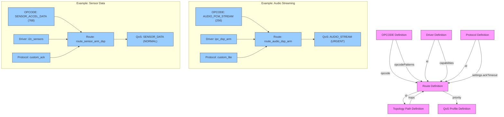

# OPCODE Messaging System - Supplementary Content

*Date: 2025-08-12*

## 1. End-to-End Configuration Visualization

The following diagram shows a comprehensive end-to-end visualization of how all configuration elements relate to each other in the messaging system:

```mermaid
graph TD
    %% OPCODE Registration and Classification
    subgraph OPCODEManagement["OPCODE Management"]
        OP_REG[OpcodeRegistry]
        OP_DEFS[OPCODE Definitions]

        OP_SYS["System OPCODEs<br/>0x0001-0x00FF"]
        OP_AUDIO["Audio OPCODEs<br/>0x0100-0x01FF"]
        OP_BLE["BLE OPCODEs<br/>0x0200-0x02FF"]
        OP_SENSOR["Sensor OPCODEs<br/>0x0300-0x03FF"]
        OP_APP["Application OPCODEs<br/>0x1000-0x1FFF"]

        OP_DEFS --> OP_REG
        OP_REG --> OP_SYS
        OP_REG --> OP_AUDIO
        OP_REG --> OP_BLE
        OP_REG --> OP_SENSOR
        OP_REG --> OP_APP
    end

    %% Subscription Management
    subgraph SubscriptionManagement["Subscription Management"]
        SUB_MGR[SubscriptionManager]
        OP_TARGETS[Subscriber Targets]

        SUB_MGR --> OP_TARGETS
    end

    %% Protocol Configuration
    subgraph ProtocolConfiguration["Protocol Configuration"]
        PROTO_FACT[ProtocolFactory]

        PROTO_ACK["CUSTOM_ACK Protocol<br/>Reliability, Retry, CRC"]
        PROTO_LITE["CUSTOM_LITE Protocol<br/>Lightweight, Header Compression"]
        PROTO_SEC["SECURE_AES Protocol<br/>Encryption, Authentication"]

        PROTO_FACT --> PROTO_ACK
        PROTO_FACT --> PROTO_LITE
        PROTO_FACT --> PROTO_SEC
    end

    %% Driver Configuration
    subgraph DriverConfiguration["Driver Configuration"]
        DRV_FACT[DriverFactory]

        DRV_IPC["IPC Driver<br/>OpenAMP, Mailbox"]
        DRV_I2C["I2C Driver<br/>STM32HAL, NXP"]
        DRV_SPI["SPI Driver<br/>STM32, QSPI"]
        DRV_UART["UART Driver<br/>STM32HAL, Linux"]

        DRV_FACT --> DRV_IPC
        DRV_FACT --> DRV_I2C
        DRV_FACT --> DRV_SPI
        DRV_FACT --> DRV_UART
    end

    %% Route Configuration
    subgraph RouteConfiguration["Route Configuration"]
        ROUTE_MGR[RouteManager]

        ROUTE_SYS["System Routes<br/>Core-to-Core"]
        ROUTE_PERIPH["Peripheral Routes<br/>Core-to-Device"]
        ROUTE_MULTI["Multi-Hop Routes<br/>Across SoCs"]

        ROUTE_MGR --> ROUTE_SYS
        ROUTE_MGR --> ROUTE_PERIPH
        ROUTE_MGR --> ROUTE_MULTI
    end

    %% QoS Configuration
    subgraph QoSConfiguration["QoS Configuration"]
        QOS_MGR[QoSManager]

        QOS_URGENT["URGENT Priority<br/>Low Latency, Preemptive"]
        QOS_HIGH["HIGH Priority<br/>Guaranteed Delivery"]
        QOS_NORMAL["NORMAL Priority<br/>Best Effort"]
        QOS_LOW["LOW Priority<br/>Background"]

        QOS_MGR --> QOS_URGENT
        QOS_MGR --> QOS_HIGH
        QOS_MGR --> QOS_NORMAL
        QOS_MGR --> QOS_LOW
    end

    %% Communication Manager - Central Component
    CM[CommManager]

    %% Application interactions
    APP_PUB["Application publish()"]
    APP_SUB["Application subscribe()"]
    APP_PUB --> CM
    CM --> APP_SUB

    %% Configuration Manager
    CFG_MGR[ConfigManager]
    CFG_MGR -->|hot-swap| CM

    %% Relationships between components
    OP_REG -->|validate opcodes| CM
    SUB_MGR -->|resolve callbacks| CM
    CM -->|selects protocol| PROTO_FACT
    CM -->|uses drivers| DRV_FACT
    CM -->|routes messages| ROUTE_MGR
    CM -->|enforces QoS| QOS_MGR

    %% Cross-component relationships
    OP_TARGETS -->|determine| ROUTE_MGR
    ROUTE_MGR -->|selects| DRV_FACT
    ROUTE_MGR -->|applies| QOS_MGR
    ROUTE_MGR -->|configures| PROTO_FACT

    %% Physical connections between nodes
    subgraph PhysicalTopology["Physical Topology"]
        SOC1["SoC1 (ARM + DSP)"]
        SOC2["SoC2 (MCU)"]
        SOC3["SoC3 (Sensor Hub)"]

        SOC1 <-->|IPC| SOC1
        SOC1 <-->|I2C| SOC2
        SOC1 <-->|SPI| SOC3
    end

    DRV_FACT -->|implements| SOC1
    DRV_FACT -->|implements| SOC2
    DRV_FACT -->|implements| SOC3

    %% Style nodes
    classDef configNode fill:#f9f,stroke:#333,stroke-width:1px
    classDef managerNode fill:#ff9,stroke:#333,stroke-width:2px
    classDef appNode fill:#9cf,stroke:#333,stroke-width:1px
    classDef hardwareNode fill:#cfc,stroke:#333,stroke-width:1px

    class CFG_MGR,OP_REG,SUB_MGR,PROTO_FACT,DRV_FACT,ROUTE_MGR,QOS_MGR managerNode
    class OP_SYS,OP_AUDIO,OP_BLE,OP_SENSOR,OP_APP,PROTO_ACK,PROTO_LITE,PROTO_SEC,DRV_IPC,DRV_I2C,DRV_SPI,DRV_UART,ROUTE_SYS,ROUTE_PERIPH,ROUTE_MULTI,QOS_URGENT,QOS_HIGH,QOS_NORMAL,QOS_LOW configNode
    class APP_PUB,APP_SUB,CM appNode
    class SOC1,SOC2,SOC3 hardwareNode
```

### 1.1 Configuration Relationship Breakdown

This detailed diagram visualizes how the configuration elements are interconnected:

## 2. Best Practice: OpcodeRegistry Management

### 2.1 OPCODE Namespaces and Ownership

**Key Concept**: Organize OPCODEs into logical namespaces with clear ownership boundaries.

#### Namespace Definition Best Practices

1. **Structured Range Allocation**
   - Reserve specific ranges for system, audio, connectivity, sensors, and application-specific OPCODEs
   - Example: 0x0001-0x00FF for system control, 0x0100-0x01FF for audio processing

2. **Ownership and Access Control**
   - Define clear ownership of each namespace (who can register/modify OPCODEs)
   - Specify read access permissions (who can use/subscribe to OPCODEs)
   - Implement authorization checks during registration and subscription

3. **Documentation and Metadata**
   - Include comprehensive metadata with each OPCODE (description, payload format, version)
   - Maintain machine-readable documentation for automatic code generation and validation

### 2.2 Versioning and Compatibility

**Key Concept**: Implement a robust versioning system to manage OPCODE evolution.

1. **Version Tracking**
   - Track version numbers for each OPCODE
   - Maintain history of OPCODE changes
   - Enforce version increment rules (major.minor.patch)

2. **Compatibility Rules**
   - Define clear compatibility matrices between versions
   - Major version changes indicate breaking changes in payload format
   - Minor version changes maintain backward compatibility

3. **Deprecation Process**
   - Formal process for deprecating OPCODEs
   - Grace period for transition to replacement OPCODEs
   - Automatic notifications to affected modules

### 2.3 Performance Optimization

**Key Concept**: Optimize frequently used OPCODE operations.

1. **Hot Path Caching**
   - Maintain fast-path cache for frequently accessed OPCODEs
   - Track access patterns to automatically optimize cache contents
   - Thread-safe implementation with minimal locking

2. **Batch Operations**
   - Support atomic batch registration of related OPCODEs
   - Transactional updates with rollback capability
   - Bulk validation for consistent state

3. **Memory Efficiency**
   - Compact storage for OPCODE metadata
   - String interning for repeated fields
   - Lazy loading for detailed metadata

## 3. Best Practice: Route Management

### 3.1 Path Optimization and Redundancy

**Key Concept**: Implement intelligent path selection with redundancy.

1. **Dynamic Path Cost Calculation**
   - Assign base costs to routes based on latency, bandwidth, and reliability
   - Dynamically adjust costs based on current health and performance metrics
   - Re-evaluate path costs periodically for optimal routing

2. **Multi-hop Path Planning**
   - Pre-compute common paths at startup for faster routing decisions
   - Implement efficient path-finding algorithms (Dijkstra's algorithm)
   - Consider QoS requirements when selecting paths

3. **Route Redundancy**
   - Define primary and backup routes for critical paths
   - Implement automatic failover to backup routes
   - Return to primary routes when they recover

### 3.2 Health Monitoring

**Key Concept**: Monitor and react to route health issues.

1. **Route Health Metrics**
   - Track success/failure rates per route
   - Monitor latency and throughput
   - Detect patterns of intermittent failures

2. **Circuit Breaking**
   - Mark routes as failing when error rates exceed thresholds
   - Implement exponential backoff for retries
   - Automatically restore routes when health improves

3. **Health Reporting**
   - Generate health reports for system diagnostics
   - Trend analysis for predictive maintenance
   - Alert on degrading route quality

### 3.3 Configuration Validation

**Key Concept**: Ensure valid and consistent routing configuration.

1. **Route Validation Rules**
   - Verify route continuity (no gaps in multi-hop paths)
   - Check for circular dependencies
   - Validate driver capability requirements

2. **Constraint Evaluation**
   - Parse and evaluate capability expressions ("maxFrame>=256", "latency<100")
   - Verify QoS requirements can be met
   - Check security constraints

3. **Hot-swap Safety**
   - Validate new configuration before applying
   - Atomic updates to avoid partial configuration
   - Rollback capability for failed updates
