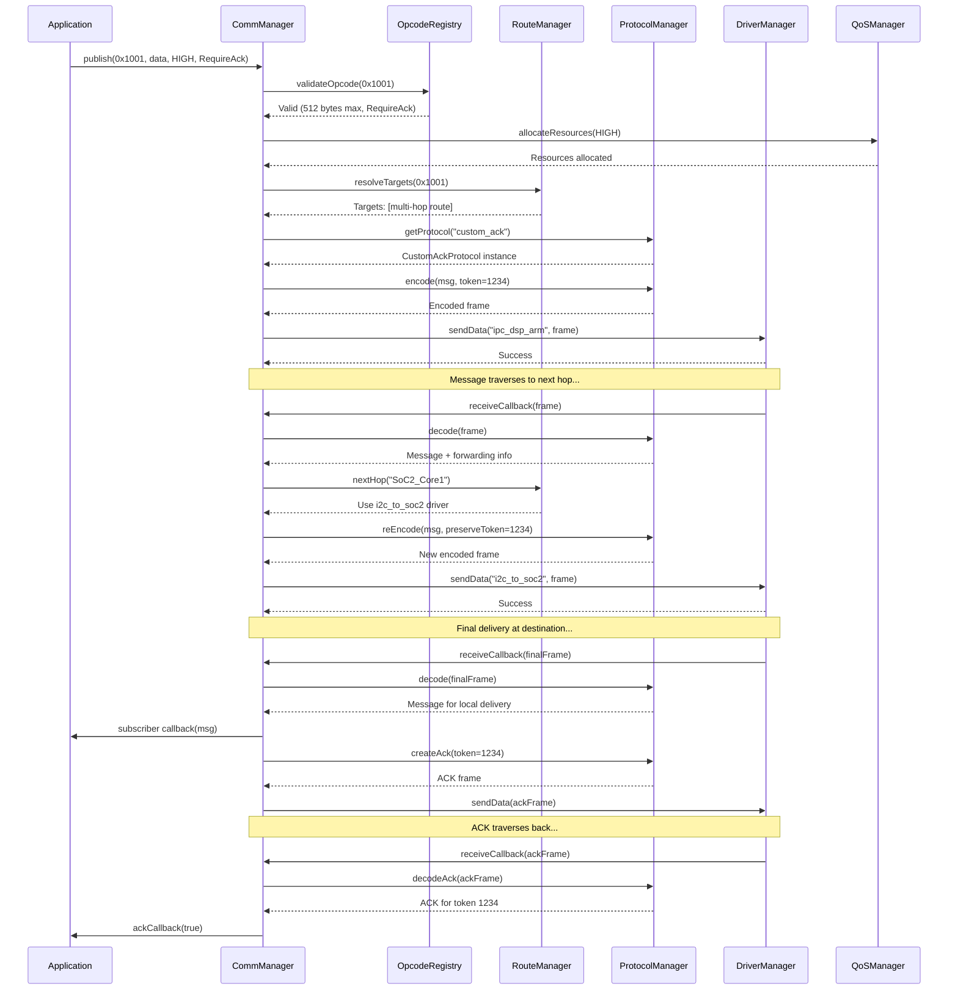

# OPCODE Messaging System - Best Practice Managers

*Date: 2025-08-12*

## 1. Driver Management Best Practices

### 1.1 Resource Management

**Key Concept**: Efficiently manage hardware resources used by drivers.

1. **Resource Allocation Tracking**
   - Track hardware resources (peripherals, DMA channels, IRQs) used by each driver
   - Prevent resource conflicts during driver creation
   - Implement resource locking mechanisms

2. **Power Management**
   - Categorize drivers by power consumption profiles
   - Support low-power modes when idle
   - Coordinate driver power states with system power states

3. **Memory Optimization**
   - Right-size buffers based on traffic patterns
   - Implement buffer pooling for efficient memory use
   - Support zero-copy operations where possible

### 1.2 Driver Lifecycle Management

**Key Concept**: Handle driver creation, monitoring, and shutdown gracefully.

1. **Staged Initialization**
   - Validate configuration before resource allocation
   - Perform initialization in discrete, recoverable stages
   - Implement clean rollback if any stage fails

2. **Health Monitoring**
   - Track error rates, latency, and throughput
   - Implement watchdog mechanisms for hanging drivers
   - Detect and handle resource leaks

3. **Graceful Shutdown**
   - Complete pending operations before shutdown
   - Release resources in reverse order of acquisition
   - Notify dependent components of impending shutdown

### 1.3 Hot-Swap and Resilience

**Key Concept**: Support runtime driver replacement without message loss.

1. **Hot-Swap Implementation**
   - Create new driver instance alongside existing one
   - Gradually transition traffic to new driver
   - Perform verification before completing swap

2. **Error Recovery**
   - Implement automatic recovery for transient errors
   - Support driver restart without application impact
   - Maintain consistent state during recovery

3. **Fault Isolation**
   - Prevent driver failures from cascading to other system components
   - Compartmentalize error handling
   - Provide fallback mechanisms for critical functions

## 2. Protocol Factory Best Practices

### 2.1 Protocol Design Patterns

**Key Concept**: Implement flexible, efficient protocols with clear responsibilities.

1. **Protocol Layering**
   - Separate concerns between base transport, reliability, and security
   - Allow mix-and-match protocol features
   - Implement clean interfaces between layers

2. **Header Optimization**
   - Implement variable-length headers based on features needed
   - Use bit-field packing for compact headers
   - Support header compression for bandwidth efficiency

3. **Protocol Negotiation**
   - Allow capability discovery and feature negotiation
   - Support backward compatibility with older protocol versions
   - Implement graceful degradation when features aren't supported

### 2.2 Reliability Mechanisms

**Key Concept**: Ensure message delivery with efficient reliability mechanisms.

1. **Acknowledgment Strategies**
   - Support various ACK policies (immediate, delayed, selective)
   - Implement efficient token tracking for multi-hop ACKs
   - Optimize ACK batching for efficiency

2. **Retransmission Management**
   - Implement adaptive retransmission timeouts
   - Support jittered exponential backoff
   - Optimize for different network characteristics

3. **Flow Control**
   - Implement receiver-driven flow control
   - Support dynamic window sizing based on congestion
   - Prevent buffer overflow conditions

### 2.3 Security Integration

**Key Concept**: Integrate security features seamlessly into protocols.

1. **Layered Security**
   - Support encryption, authentication, and integrity checks
   - Allow security feature selection based on sensitivity
   - Implement efficient key management

2. **Performance Optimization**
   - Hardware acceleration for crypto operations
   - Selective encryption of sensitive fields
   - Session key negotiation for reduced overhead

3. **Security Policy Enforcement**
   - Enforce minimum security requirements per OPCODE range
   - Audit logging for security-relevant operations
   - Support secure channels for privileged operations

## 3. QoS Management Best Practices

### 3.1 Priority Management

**Key Concept**: Implement effective message prioritization.

1. **Multi-level Priority Queues**
   - Implement separate queues for each priority level
   - Use priority inheritance to prevent priority inversion
   - Apply starvation prevention for lower priorities

2. **Adaptive Scheduling**
   - Implement deficit round-robin for fair scheduling
   - Adjust scheduling weights based on queue depths
   - Support preemption for urgent messages

3. **Priority Propagation**
   - Preserve message priority across network hops
   - Map priorities appropriately between different domains
   - Support priority elevation for time-critical responses

### 3.2 Resource Reservation

**Key Concept**: Ensure resources are available for critical message flows.

1. **Bandwidth Reservation**
   - Reserve minimum bandwidth for each priority level
   - Implement admission control for new message flows
   - Support dynamic reallocation based on demand

2. **CPU Scheduling**
   - Coordinate thread priorities with message priorities
   - Implement priority-aware worker pools
   - Prevent processing bottlenecks

3. **Memory Management**
   - Pre-allocate buffers for high-priority messages
   - Implement separate memory pools per priority
   - Prevent high-priority queue starvation due to memory exhaustion

### 3.3 Congestion Management

**Key Concept**: Handle congestion gracefully to maintain system stability.

1. **Backpressure Mechanisms**
   - Implement end-to-end backpressure signals
   - Support push-back through multi-hop routes
   - Provide clear API indications for application-level handling

2. **Adaptive Rate Control**
   - Monitor queue depths to detect congestion
   - Implement AIMD (Additive Increase, Multiplicative Decrease) for rate control
   - Apply different rate control policies per priority

3. **Graceful Degradation**
   - Define message drop policies under extreme congestion
   - Preserve critical message flows during overload
   - Support quality reduction for streams (e.g., audio) instead of complete loss

## 4. Configuration Manager Best Practices

### 4.1 Configuration Validation

**Key Concept**: Ensure configuration integrity and correctness.

1. **Multi-level Validation**
   - Syntax validation (JSON schema, required fields)
   - Semantic validation (references, dependencies)
   - System constraint validation (resource limits, compatibility)

2. **Cross-reference Checking**
   - Verify all referenced components exist
   - Check for circular dependencies
   - Validate capability requirements against actual capabilities

3. **Hash Verification**
   - Compute and verify configuration hashes
   - Detect unauthorized modifications
   - Support signed configurations for security

### 4.2 Hot-swap Implementation

**Key Concept**: Change configuration at runtime without disruption.

1. **Atomic Updates**
   - Prepare complete new configuration before applying
   - Apply changes in a single atomic operation
   - Support all-or-nothing semantics

2. **State Preservation**
   - Maintain active connections during reconfiguration
   - Preserve message queues during transition
   - Ensure no messages are lost during swap

3. **Rollback Capability**
   - Maintain backup of previous configuration
   - Implement clean rollback if errors occur
   - Log detailed error information for debugging

### 4.3 Configuration Storage and Distribution

**Key Concept**: Manage configuration across distributed system.

1. **Hierarchical Configuration**
   - Support system, node, and component level configurations
   - Implement inheritance and overrides
   - Maintain clear precedence rules

2. **Version Control**
   - Track configuration versions with timestamps
   - Support configuration history and diff
   - Enable rollback to previous versions

3. **Distributed Coordination**
   - Synchronize configuration changes across nodes
   - Implement leader election for configuration management
   - Support partial updates for efficiency

## 5. Integration Visualization: End-to-End Message Flow with Manager Interactions

This diagram illustrates how the different managers interact during message processing, from publication through multi-hop routing to final delivery and acknowledgment, showing the clear separation of responsibilities between components.