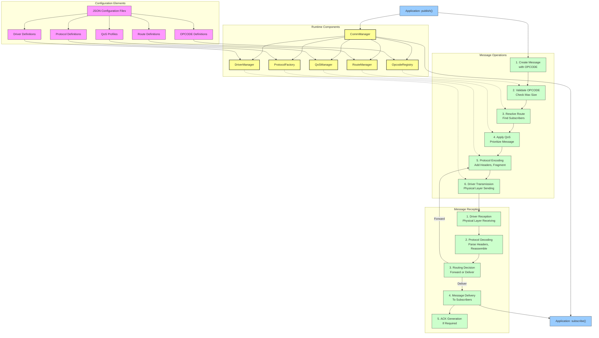
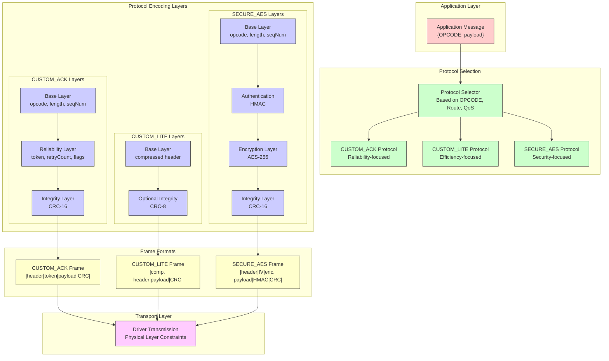
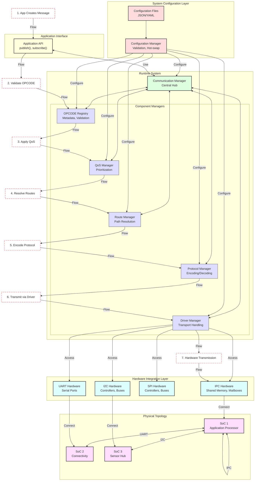

# OPCODE Messaging System - Advanced Visualization and Integration

*Date: 2025-08-12*

## 1. Comprehensive End-to-End Configuration Mapping

This detailed visualization shows the complete journey from OPCODE definition to final message delivery, with all configuration components mapped to their roles in the process.

## 2. Advanced Visualization: Multi-SoC OPCODE Routing

This visualization demonstrates how OPCODEs are routed across a complex multi-SoC system with different transport layers.

```mermaid
graph TD
    %% SoCs and Cores
    subgraph SoC1["SoC1 - Application Processor"]
        SoC1_ARM["ARM Core (Application)"]
        SoC1_DSP["DSP Core (Audio Processing)"]

        SoC1_ARM ---|"OpenAMP IPC"| SoC1_DSP
    end

    subgraph SoC2["SoC2 - Connectivity"]
        SoC2_BLE["BLE Core"]
    end

    subgraph SoC3["SoC3 - Sensor Hub"]
        SoC3_MCU["MCU Core (Sensor Processing)"]
    end

    %% Inter-SoC Connections
    SoC1_ARM ---|"UART"| SoC2_BLE
    SoC1_ARM ---|"I2C"| SoC3_MCU

    %% OPCODE Routing Visualization
    SYS_OPCODES["System OPCODEs<br/>(0x0001-0x00FF)"]
    AUDIO_OPCODES["Audio OPCODEs<br/>(0x0100-0x01FF)"]
    BLE_OPCODES["BLE OPCODEs<br/>(0x0200-0x02FF)"]
    SENSOR_OPCODES["Sensor OPCODEs<br/>(0x0300-0x03FF)"]

    %% OPCODE to Core Subscriptions
    SYS_OPCODES -->|"Subscribe"| SoC1_ARM
    SYS_OPCODES -->|"Subscribe"| SoC2_BLE
    SYS_OPCODES -->|"Subscribe"| SoC3_MCU

    AUDIO_OPCODES -->|"Subscribe"| SoC1_DSP
    AUDIO_OPCODES -->|"Limited Subscribe"| SoC1_ARM

    BLE_OPCODES -->|"Primary Subscribe"| SoC2_BLE
    BLE_OPCODES -->|"Status Subscribe"| SoC1_ARM

    SENSOR_OPCODES -->|"Primary Subscribe"| SoC3_MCU
    SENSOR_OPCODES -->|"Processed Data Subscribe"| SoC1_ARM
    SENSOR_OPCODES -->|"Motion Events Subscribe"| SoC1_DSP

    %% Example Message Flows
    MSG_SYS["SYS_POWER_STATE<br/>OPCODE 0x0002"]
    MSG_SYS -->|"Publish"| SoC1_ARM

    MSG_AUDIO["AUDIO_EQ_SETTINGS<br/>OPCODE 0x0101"]
    MSG_AUDIO -->|"Publish"| SoC1_ARM

    MSG_BLE["BLE_CONNECTION_STATE<br/>OPCODE 0x0200"]
    MSG_BLE -->|"Publish"| SoC2_BLE

    MSG_SENSOR["SENSOR_ACCEL_DATA<br/>OPCODE 0x0300"]
    MSG_SENSOR -->|"Publish"| SoC3_MCU

    %% Routing Paths with Protocols
    SoC1_ARM -->|"custom_ack, HIGH"| SoC1_DSP
    SoC1_ARM -->|"secure_protocol, HIGH"| SoC2_BLE
    SoC1_ARM -->|"custom_ack, NORMAL"| SoC3_MCU

    SoC2_BLE -->|"secure_protocol, HIGH"| SoC1_ARM

    SoC3_MCU -->|"custom_ack, LOW"| SoC1_ARM
    SoC1_ARM -->|"custom_lite, NORMAL"| SoC1_DSP

    %% Style nodes
    classDef socNode fill:#ffcccc,stroke:#333,stroke-width:2px
    classDef coreNode fill:#ccffcc,stroke:#333,stroke-width:1px
    classDef opcodeNode fill:#ccccff,stroke:#333,stroke-width:1px
    classDef msgNode fill:#ffffcc,stroke:#333,stroke-width:1px

    class SoC1_ARM,SoC1_DSP,SoC2_BLE,SoC3_MCU coreNode
    class SYS_OPCODES,AUDIO_OPCODES,BLE_OPCODES,SENSOR_OPCODES opcodeNode
    class MSG_SYS,MSG_AUDIO,MSG_BLE,MSG_SENSOR msgNode
```

## 3. Protocol Stack Visualization

This diagram illustrates the layered protocol architecture and how different protocol variants handle message encapsulation.

## 4. QoS Management Visualization

This diagram shows how QoS policies are applied to messages based on priority and route characteristics.

```mermaid
graph TD
    %% Message Creation with QoS
    MSG_CREATE["New Message<br/>{OPCODE, payload, priority}"]

    subgraph QoSClassification["QoS Classification"]
        QOS_CLASSIFY["QoS Classification<br/>Based on OPCODE, Priority"]

        QOS_URGENT["URGENT QoS<br/>Realtime, Low Latency"]
        QOS_HIGH["HIGH QoS<br/>Guaranteed Delivery"]
        QOS_NORMAL["NORMAL QoS<br/>Best Effort"]
        QOS_LOW["LOW QoS<br/>Background"]

        QOS_CLASSIFY --> QOS_URGENT
        QOS_CLASSIFY --> QOS_HIGH
        QOS_CLASSIFY --> QOS_NORMAL
        QOS_CLASSIFY --> QOS_LOW
    end

    subgraph ResourceManagement["Resource Management"]
        RES_ALLOC["Resource Allocation<br/>Based on QoS Profile"]

        CPU_ALLOC["CPU Resources<br/>Thread Priority"]
        MEM_ALLOC["Memory Allocation<br/>Dedicated Pools"]
        BW_ALLOC["Bandwidth Allocation<br/>Transmission Slots"]

        RES_ALLOC --> CPU_ALLOC
        RES_ALLOC --> MEM_ALLOC
        RES_ALLOC --> BW_ALLOC
    end

    subgraph QueueManagement["Queue Management"]
        QUEUE_MGR["Priority Queue Manager"]

        QUEUE_U["URGENT Queue<br/>Preemptive"]
        QUEUE_H["HIGH Queue"]
        QUEUE_N["NORMAL Queue"]
        QUEUE_L["LOW Queue"]

        QUEUE_MGR --> QUEUE_U
        QUEUE_MGR --> QUEUE_H
        QUEUE_MGR --> QUEUE_N
        QUEUE_MGR --> QUEUE_L
    end

    subgraph Scheduler["Scheduler"]
        SCHED["Queue Scheduler<br/>Deficit Round-Robin"]

        SCHED_U["URGENT Scheduler<br/>Weight: 16"]
        SCHED_H["HIGH Scheduler<br/>Weight: 8"]
        SCHED_N["NORMAL Scheduler<br/>Weight: 4"]
        SCHED_L["LOW Scheduler<br/>Weight: 1"]

        SCHED --> SCHED_U
        SCHED --> SCHED_H
        SCHED --> SCHED_N
        SCHED --> SCHED_L
    end

    subgraph Transmission["Transmission"]
        TX_MGR["Transmission Manager"]

        TX_IMMEDIATE["Immediate Transmission<br/>URGENT Messages"]
        TX_RELIABLE["Reliable Transmission<br/>HIGH/NORMAL Messages"]
        TX_BACKGROUND["Background Transmission<br/>LOW Messages"]

        TX_MGR --> TX_IMMEDIATE
        TX_MGR --> TX_RELIABLE
        TX_MGR --> TX_BACKGROUND
    end

    %% Message flow
    MSG_CREATE --> QOS_CLASSIFY

    QOS_URGENT --> RES_ALLOC
    QOS_HIGH --> RES_ALLOC
    QOS_NORMAL --> RES_ALLOC
    QOS_LOW --> RES_ALLOC

    QOS_URGENT --> QUEUE_U
    QOS_HIGH --> QUEUE_H
    QOS_NORMAL --> QUEUE_N
    QOS_LOW --> QUEUE_L

    QUEUE_U --> SCHED_U
    QUEUE_H --> SCHED_H
    QUEUE_N --> SCHED_N
    QUEUE_L --> SCHED_L

    SCHED_U --> TX_IMMEDIATE
    SCHED_H --> TX_RELIABLE
    SCHED_N --> TX_RELIABLE
    SCHED_L --> TX_BACKGROUND

    TX_IMMEDIATE --> MSG_SEND["Message Transmission"]
    TX_RELIABLE --> MSG_SEND
    TX_BACKGROUND --> MSG_SEND

    %% Style nodes
    classDef msgCreate fill:#ffcccc,stroke:#333,stroke-width:1px
    classDef qosClass fill:#ccffcc,stroke:#333,stroke-width:1px
    classDef resAlloc fill:#ccccff,stroke:#333,stroke-width:1px
    classDef queueMgr fill:#ffffcc,stroke:#333,stroke-width:1px
    classDef scheduler fill:#ffccff,stroke:#333,stroke-width:1px
    classDef transmission fill:#ccffff,stroke:#333,stroke-width:1px

    class MSG_CREATE,MSG_SEND msgCreate
    class QOS_CLASSIFY,QOS_URGENT,QOS_HIGH,QOS_NORMAL,QOS_LOW qosClass
    class RES_ALLOC,CPU_ALLOC,MEM_ALLOC,BW_ALLOC resAlloc
    class QUEUE_MGR,QUEUE_U,QUEUE_H,QUEUE_N,QUEUE_L queueMgr
    class SCHED,SCHED_U,SCHED_H,SCHED_N,SCHED_L scheduler
    class TX_MGR,TX_IMMEDIATE,TX_RELIABLE,TX_BACKGROUND transmission
```

## 5. End-to-End System Integration View

This comprehensive visualization shows the complete system with all components and their interactions, from configuration through runtime execution.

This comprehensive set of visualizations provides a clear understanding of how the entire OPCODE messaging system works together, from configuration through runtime message processing, across multiple SoCs and transport layers.
